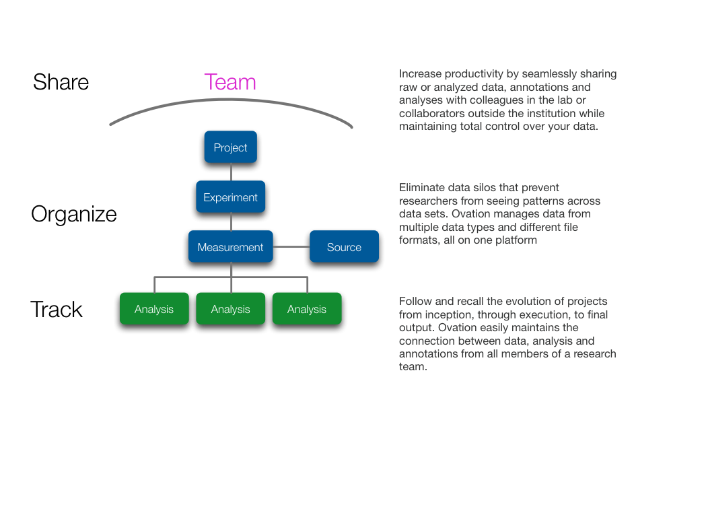

.. _doc-about-ovation:

.. raw:: html

    

        <ul class="nav nav-pills" style="display: inline-block">
            <li class="active"><a href="#">About Ovation</a></li>
            <li class="disabled"><a href="#">&raquo;</a></li>
            <li><a href="installation.html">Install</a></li>
            <li class="disabled"><a href="#">&raquo;</a></li>
            <li><a href="create_project.html">Create a Project</a></li>
            <li class="disabled"><a href="#">&raquo;</a></li>
            <li><a href="create_experiment.html">Create an Experiment</a></li>
            <li class="disabled"><a href="#">&raquo;</a></li>
            <li><a href="create_measurement_and_source.html">Create a Measurement and add a Source</a></li>
        </ul>
    

*************
About Ovation
*************

Ovation is the revolutionary data management service that empowers researchers through the seamless organization of multiple data formats and sources, preservation of the link between raw data and analyses and the ability to securely share of all of this with colleagues and collaborators.

    
