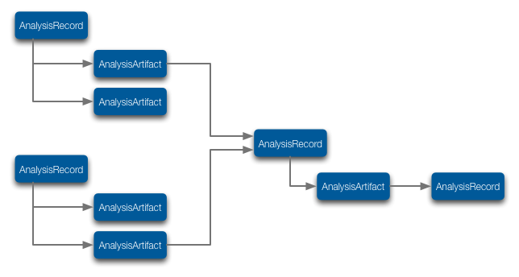

.. _doc-analysis-records-guide:

************************
Analysis Records
************************

``AnalysisRecords`` describe a single step of analysis in the chain from *Measurements* to “final” result (yeah, we know—science is never really done!). An ``AnalysisRecord`` associates inputs—*Measurements* or the outputs of other *AnalysisRecords*, a *Protocol*, ``analysisParameters`` (like ``protocolParameters`` for a *Procedure*) and the results (“outputs”).

.. figure:: _static/protocol-analysisrecord.png
    :align: center
    
    An AnalysisRecord associates inputs, protocol (code or procedure), parameters and outputs of an analysis.

To create an `AnalysisRecord`, right-click on a `Project` or `Epoch` in the Ovation application and select "Insert Analysis Record…" or use the corresponding API calls to create an `AnalysisRecord` programatically (`project` is a Project instance):

.. language_specific::
    --Python
    ::
    
        from ovation.conversion import to_map
    
        # Create an iterable of inputs
        inputs = (measurement1, measurement2, measurement3)
        
        # Designate the protocol for this analysis
        protocol = context.getProtocol('First analysis v1')
        if protocol is None:
            protocol = context.insertProtocol('First analysis v1',          # protocol name
                            '...analysis description...',                   # text block describing the analysis (e.g. its algorithms or approaches)
                            'analysis_fn',                                  # name of the "top-level" analysis function
                            'git@github.com:physion/ovation-docs.git',      # the URL hosting analysis code (we use the Ovation documentation site's GitHub repository as an example)
                            '96ff339f30297f3dda2e14ec9babaa590acd8174',     # revision number of the analysis code
                
                )
        
        
        # Record any parameters of the analysis
        parameters = {}
        parameters['threshold'] = 1.0
        parameters['max_n'] = 10
        
        
        ar = project.addAnalysisRecord('First analysis',# record name
            inputs,                                     # iterable of inputs (Measurements and/or AnalysisOutputs)
            protocol,                                   # analysis protocol
            to_map(parameters)                          # analysis parameters
            )
    --R
    ::
    
        # Create an iterable of inputs
        inputs = c(measurement1, measurement2, measurement3)
        
        # Designate the protocol for this analysis
        protocol <- context$getProtocol('First analysis v1')
        if(is.null(protocol)) {
            protocol = context$insertProtocol('First analysis v1',          # protocol name
                            '...analysis description...',                   # text block describing the analysis (e.g. its algorithms or approaches)
                            'analysis_fn',                                  # name of the "top-level" analysis function
                            'git@github.com:physion/ovation-docs.git',      # the URL hosting analysis code (we use the Ovation documentation site's GitHub repository as an example)
                            '96ff339f30297f3dda2e14ec9babaa590acd8174',     # revision number of the analysis code
                
                )
        }
        
        # Record any parameters of the analysis
        parameters <- list(threshold=1.0, max_n=10)
        
        
        ar<-project$addAnalysisRecord('First analysis', # record name
            inputs,                                     # iterable of inputs (Measurements and/or AnalysisOutputs)
            protocol,                                   # analysis protocol
            list2map(parameters)                        # analysis parameters
            )
            
    --Matlab
    ::
    
        % Create an iterable of inputs
        inputs = [measurement1, measurement2, measurement3];
        
        % Designate the protocol for this analysis
        protocol = context.getProtocol('First analysis v1');
        if(isempty(protocol))
            protocol = context.insertProtocol('First analysis v1',...       % protocol name
                            '...analysis description...',...                % text block describing the analysis (e.g. its algorithms or approaches)
                            'analysis_fn',...                               % name of the "top-level" analysis function
                            'git@github.com:physion/ovation-docs.git',...   % the URL hosting analysis code (we use the Ovation documentation site's GitHub repository as an example)
                            '96ff339f30297f3dda2e14ec9babaa590acd8174',...  % revision number of the analysis code
                
                );
        end
        
        
        % Record any parameters of the analysis
        parameters = struct();
        parameters.threshold = 1.0;
        parameters.max_n = 10;
        
        
        ar = project.addAnalysisRecord('First analysis',% record name
            inputs,                                     % iterable of inputs (Measurements and/or AnalysisOutputs)
            protocol,                                   % analysis protocol
            struct2map(parameters)                      % analysis parameters
            );
    

.. OUTPUT

To add an analysis output (an "artifact") such as a numeric matrix, table, image or figure, right-click on the `AnalysisRecord` in the Ovation application and choose "Add Analysis Output…" or use the corresponding API calls to an an analysis output programatically:

.. language_specific::
    --Python
    ::
    
        from ovation.conversion import to_file_url
        from ovation.data import insert_numeric_analysis_artifact
        
        # outputs may be specified by URL and content type
        ar.addOutput('Output name',         # display name for this output
            to_file_url(output_file_path),  # path to file containing the output "data"
            'application/octet-stream'      # output content type (this is a generic binary file)
            )
            
        # or you can provide numeric outputs directly
        import numpy as np
        import quantities as pq
        
        output_data = np.random.randn(10) * pq.dimensionless    # dimensionless data in this example
        output_data.labels = [u'dimensionless']
        output_data.name = u'analysis results'
        output_data.sampling_rates = [1.0 * pq.dimensionless]   # dimensionless sampling rate for non-time series data
        
        df = {'output_data' : output_data}
        insert_numeric_analysis_artifact(ar,        # analysis record
            'Output name',                          # display name for this output
            df                                      # output data frame
            )
    
    --R
    ::
    
        # outputs may be specified by URL and content type
        ar$addOutput('Output name',         # display name for this output
            NewUrl(output_file_path),       # path to file containing the output "data"
            'application/octet-stream'      # output content type (this is a generic binary file)
            )
            
        # or you can provide numeric outputs directly
        nd <- NumericData('data_series', c(1,2,3), 'dimensionless', 1, 'dimensionless');
        
        ar$addNumericOutput('Output name',  # display name for this output
            nd                              # output data
            )
            
    --Matlab
    ::
    
        import java.net.URL
        
        % outputs may be specified by URL and content type
        ar.addOutput('Output name',...                  % display name for this output
            URL(['file://' output_file_path]),...       % path to file containing the output "data"
            'application/octet-stream'...               % output content type (this is a generic binary file)
            )

        % or you can provide numeric outputs directly
        nd = us.physion.ovation.values.NumericData();
        nd.addData('data_series', randn(1,10), 'dimensionless', 1, 'dimensionless');
        
        ar.addNumericOutput('Output name', ...  % display name for this output
            nd...                               % output data
            )

*AnalysisRecords* can be chained using the output of one *AnalysisRecord* as the input to “downstream” *AnalysisRecords*. Use chained records to keep track of how you got from your (awesome) *Measurements* to your (awesome) results! And just in case you realize that you need to redo part of an analysis (we’ve been there!), you can use these *AnalysisRecord* chains to find all of the downstream analyses that should also be revisited.

    
    **AnalysisRecords can be chained**

To create a chained Analysis Record, simply include the upstream analysis outputs as inputs to a new Analysis Record. You can mix `Measurements` and Analysis Outputs in the inputs to an Analysis Record.