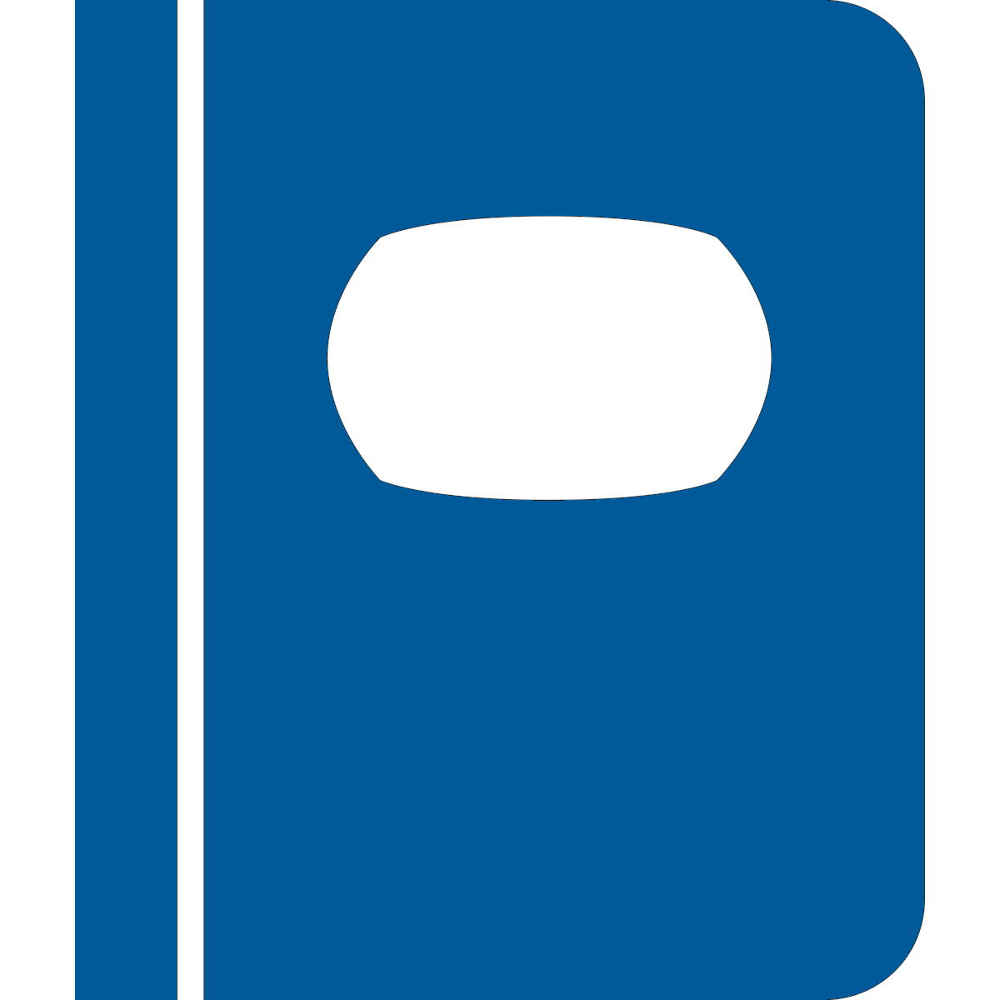
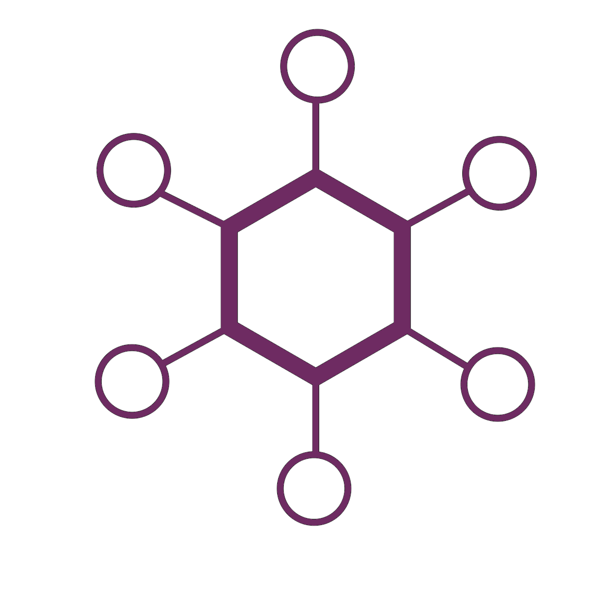
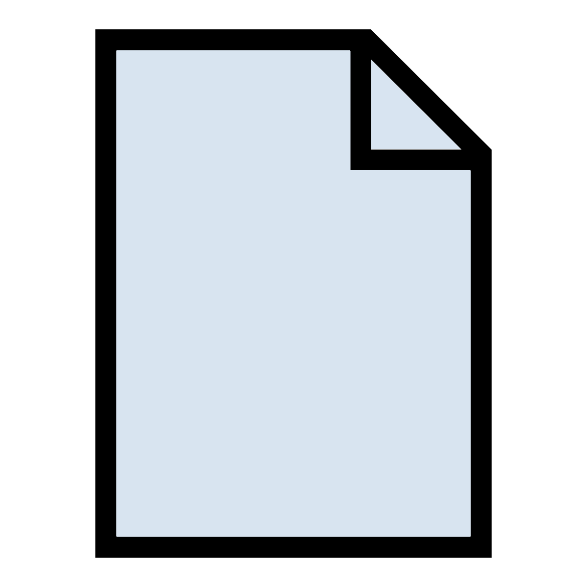

.. _doc-application-guide:

***********************
The Ovation Application
***********************

Browsers
========

The *Project*, *Source*, and *Protocol* browsers give you three views of your data. It's the same data, just viewed from a different 'vantage point'. All three browsers use the same icons to tell you what type of entity is being displayed. The table below shows the entity type associated with each icon:

.. cssclass:: table-hover
.. csv-table::
    :header: "*Icon*","*Entity*"
    :widths: 15,85
    
    |project-icon|,**Project**
    |experiment-icon|,**Experiment**
    |epoch-group-icon|,**Epoch Group**
    |epoch-icon|,**Epoch**
    |measurement-icon|,**Measurement**
    |source-icon|,**Source**
    |user-icon|,**User**
    |analysis-record-icon|,**Analysis Record**

.. |experiment-icon| image:: _static/experiment-icon.png 
                    :height: 48 
                    :width: 48

                    

                    

                                        
.. |analysis-record-icon| image:: _static/analysis-record-icon.png 
                    :height: 48 
                    :width: 48
                    
                    
.. note:: If a browser is not visible, you can open a new browser by selecting "Projects Navigator", "Sources Navigator" or "Protocols Navigator" from the "Window" menu.