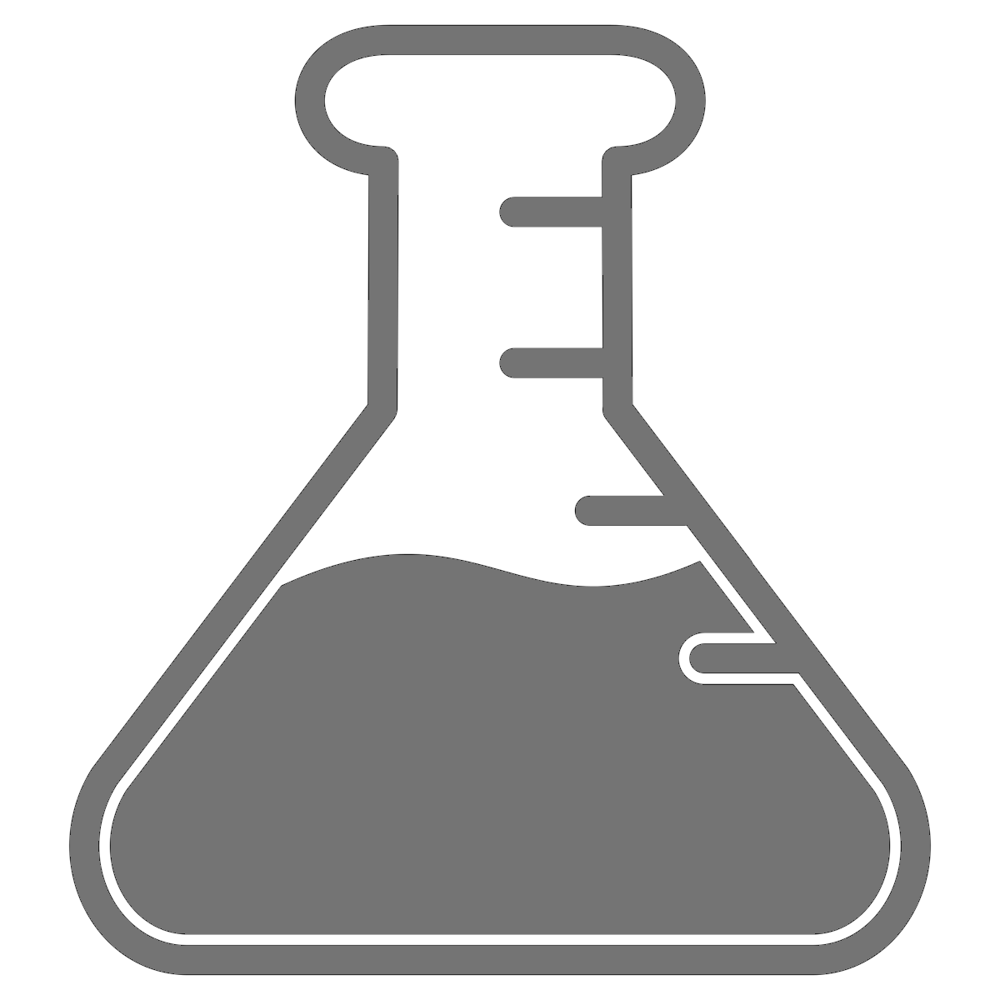

.. _doc-application-guide:

***********************
Ovation Application
***********************

The Ovation Application is an app that lets you work with Ovation right from your desktop computer. You can download the Ovation app from your ovation.io `dashboard <https://ovation.io/dashboard>`_.

.. figure:: _static/ovation_icon_osx.png
    :align: right

The :ref:`Getting Stared <doc-about-ovation>` guide has video tutorials for most of the features in the Ovation app and this page provides additional reference information.

Browsers
========

The *Project*, *Source*, and *Protocol* browsers give you three views of your data. It's the same data, just viewed from a different 'vantage point'. All three browsers use the same icons to tell you what type of entity is being displayed. The table below shows the entity type associated with each icon:

.. cssclass:: table-hover
.. csv-table::
    :header: "*Icon*","*Entity*"
    :widths: 15,85
    
    |project-icon|,**Project**
    |experiment-icon|,**Experiment**
    |epoch-group-icon|,**Epoch Group**
    |epoch-icon|,**Epoch**
    |measurement-icon|,**Measurement**
    |source-icon|,**Source**
    |user-icon|,**User**
    |analysis-record-icon|,**Analysis Record**

                    
.. |user-icon| image:: _static/user-icon.png 
                    :height: 48 
                    :width: 48

                    
.. |epoch-group-icon| image:: _static/epoch-group-icon.png 
                    :height: 48 
                    :width: 48

                                        

                    
                    
.. note:: If a browser is not visible, you can open a new browser by selecting "Projects Navigator", "Sources Navigator" or "Protocols Navigator" from the "Window" menu.