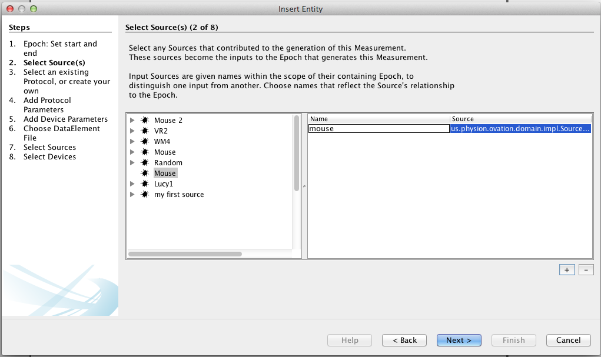

.. _doc-getting-started-create-measurement-and-source:

.. raw:: html

    <ul class="nav nav-pills">
      <li><a href="installation.html">Install</a></li>
      <li><a href="create_project.html">Create a Project</a></li>
      <li><a href="create_experiment.html">Create an Experiment</a></li>
      <li  class="active"><a href="#">Add a Measurement</a></li>
    </ul>
    
*************************************
Create a Measurement and add a Source
*************************************

.. _sec-new-data:

Now it's time to add data to our Experiment.  This is done by creating a Measurement and subsequently attaching that Measurement to the Source, or subject, from which it was collected (cell line, animal, tissue sample, etc).  To begin, right click on the Experiment and select 'Insert Measurement...'. This wizard will create a trial with one Measurement. You may optionally add more measurements to this same trial after it has been created.

Step 1 contains the start and end time for the trial, referred to in Ovation as an Epoch.

.. figure:: _static/insert_epoch_wizard1.png
   :figwidth: 60%

Step 2 allows you to select the sources that were used in this trial, or add a new Source.  Select the Source on the left and click the + button.

.. figure:: _static/select_source_wizard1.png
   :figwidth: 60%

Next, you'll want to give a name to your Source.

The next few steps are optional and will allow you to enter any relevant information on the protocol or instrumentation used to gather your measurements in this particular trial.

Step 6 is where you will choose the data file from your Measurment to add.  Some files will be available for view directly in Ovation and others will contain a link to their native application for viewing.

.. figure:: _static/insert_meausrement_image.png
   :figwidth: 60%

The next two steps allow you to select which among the sources and devices associated with the trial (Epoch) should be associated with this particular Measurement.

+------------------------------------------------------------+------------------------------------------------------------------+
| .. figure:: _static/insert_meausrement_select_sources.png  | .. figure:: _static/insert_meausrement_select_empty_devices.png  |
+------------------------------------------------------------+------------------------------------------------------------------+

Great, we have now inserted our first Measurement! Follow either the 'Insert Measurement...', 'Insert Numeric Measurement...', or 'Insert Image...' wizards to insert more data.

.. figure:: _static/measurement_inserted.png
   :figwidth: 60%

.. _sec-new-source:

Add a `Source`
#####################

Sources represent the subject of a Measurement. A Source may be a cell line, tissue, specific animal or any other object from which you have taken a measurement.

.. tip::
    You may want to store additional information about the individual, such as sex, birth date, etc. as annotations on the Source object.

Insert a Source object by right-clicking in the "Source Navigator" and choosing :guilabel:`Insert Source...`:

.. image:: _static/insert_source.png
   :width: 60%

Enter the Source's label (the displayed name of the Source) and its identifier (e.g. an identification number within an animal facility database or in an other subject registration system).

.. figure:: _static/insert_source_wizard1.png
   :width: 60%

   Entering information for a new Source object. Here, the Source is given a label 'Mouse', and an identifier corresponding to the ID of the mouse in an external animal database.

You may want to store additional information about the individual, such as sex, birth date, etc. as annotations on the Source object. To add annotations to the newly created Source, select the Source in the "Source Navigator" window and enter the annotations in the "Properties View" window (on the right side of the screen):

.. image:: _static/source_with_properties.png
   :width: 60%

.. _ovation.io: http://ovation.io
