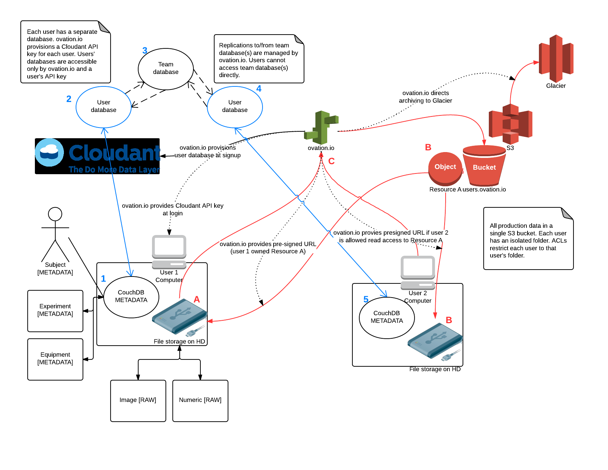

.. _doc-data-provenance:

****************************
Ovation.io data architecture
****************************

This chapter describes data architecture for the ovation.io cloud service—the chain of custody—for data as if flows through the Ovation.io infrastructure.

Ownership and Access Control
############################

Ownership
*********

Ovation maintains careful ownership and access control for every data item in the database. Each metadata item (entity or annotation) has single owner, the user that first created that data item. Files associated with `Measurement`, `AnalysisArtifact` or `Resource` entities are owned by the owner of the associated entity.

Write groups
************

The owner of a data item may create one or more *write groups*, adding any other Ovation users to these groups. All members of any write group may modify that data item and create additional write groups.

.. note:: Write groups are useful for transfering effective ownership to a new user or group when a team member changes jobs.

Access control
**************

Ovation's access control policy is based on data ownership, write group membership and team membership. Unauthenticated users are not permitted to read any data in the Ovation database. Table :ref:`tbl-acl` read and write (modify) permissions given to these three categories of users.

.. _tbl-acl:

+--------------------+---------------+-----------------+------------+--------------+
| User Role          | Read metadata | Modify metadata | Read files | Modify files |
+====================+===============+=================+============+==============+
| Owner              | Yes           | Yes             | Yes        | Yes          |
+--------------------+---------------+-----------------+------------+--------------+
| Write Group member | Yes           | Yes             | Yes        | No           |
+--------------------+---------------+-----------------+------------+--------------+
| Team member        | Yes           | No              | Yes        | No           |
+--------------------+---------------+-----------------+------------+--------------+
| Unauthenticated    | No            | No              | No         | No           |
+--------------------+---------------+-----------------+------------+--------------+

Cloud provisioning 
##################

Cloudant
********

Ovation.io provisions a unique Cloudant API key and Cloudant database (Figure :ref:`fig-data-architecture`.2) in the Physion cluster [#]_ for each ovation.io user. The user's Cloudant API key is given admin rights to their database, along with the ovation.io root account, and all others are given no access to this database.

Amazon Web Services
*******************

Ovation.io provisions a unique IAM user for each ovation.io user. In addition, a new folder in the `users.ovation.io` S3 bucket is created for the user. An ACL policy allowing the user to read and write to the `users.ovation.io/[user folder]` path is created for the IAM user. The effect of this strategy is that each ovation.io user may read and write to their designated folder, with no other access allowed outside of their folder. The ovation.io application has read/write access to the entire `users.ovation.io` bucket.

.. [#] Physion's Cloudant cluster is currently hosted by Rackspace.

Metadata
########

Experimental metadata (everything except raw measurement files) are stored in a CouchDB database on the user's computer (Figure :ref:`fig-data-architecture`.1). As new metadata is added to Ovation, this metadata is immediately stored in CouchDB (Figure :ref:`fig-data-architecture`.1). Access to the local CouchDB database is restricted by password, stored in the user's keychain (OS X) or secure key store (Windows). If multiple users log in to Ovation using the same computer account, Ovation uses separate CouchDB databases for each user, but just one local CouchDB access password (stored in the computer account keychain).

Metadata is automatically replicated to User 1's cloud database [hosted by Cloudant] (Figure :ref:`fig-data-architecture`.2). If User 1 is a member of a team, metadata in User 1's database that is part of a project shared with that Team is automatically replicated to the team's shared database [3]. Metadata in the shared team database (Figure :ref:`fig-data-architecture`.3) is automatically replicated to all team members' databases (Figure :ref:`fig-data-architecture`.2, Figure :ref:`fig-data-architecture`.4). As a result, this metadata (metadata part of a project that is shared with a team) will be replicated to all team member's local CouchDB databases (e.g. on User 2's computer).

Changes to the team's project's metadata made on User 2's computer will be saved in User 2's local CouchDB database (Figure :ref:`fig-data-architecture`.5) and similarly be replicated, eventually, to User 2's cloud database (Figure :ref:`fig-data-architecture`.4), then to the the team database (Figure :ref:`fig-data-architecture`.3), then to User 1's cloud database (Figure :ref:`fig-data-architecture`.2) and eventually to User 1's local CouchDB database (Figure :ref:`fig-data-architecture`.1).

Files
#####

Files associated with `Measurement`, `Resource`, or `AnalysisArtifact` entities are stored in cloud storage. ovation.io manages access to these cloud resources according to the access control policy shown in Table :ref:`tbl-acl`. For example, User 1 adds a new `Measurement` to the local database on User 1's computer (Figure :ref:`fig-data-architecture`.1). The file(s) associated with this `Measurement` are copied to Ovation's pending upload storage on User 1's computer (Figure :ref:`fig-data-architecture`.A). The Ovation client API uploads the file as an Object in the `users.ovation.io` bucket (Figure :ref:`fig-data-architecture`.B)[#]_. A unique URL with ovation.io as the host [#]_ is saved to the Ovation database in place of the resources actual URL. Ovation.io will redirect requests to this URL according to the access control policy described in :ref:`tbl-acl`. 

A copy of the file is cached on User 1's computer (Figure :ref:`fig-data-architecture`.A). In the case that the cached file is deleted or removed, User 1 may access the file by requesting a "pre-signed" URL for the resource from ovation.io (Figure :ref:`fig-data-architecture`.C). Beacuse User 1 is the resource owner, ovation.io provides a pre-signed URL for downloading the resource from cloud storage. When a team member requests the resource, ovation.io provides a pre-signed URL according to the the access control policy shown in Table :ref:`tbl-acl`. When an unauthenticated user requests access to the resource via ovation.io, ovation.io replies with an HTTP 404 (access denied).

.. [#] The location of Object is determined by the ovation.io service. Use of the Amazon Web Services Simple Storage Service is not guaranteed.

.. [#] Unique resource URLs currently have the form `http://ovation.io/resources/{unique id}`

.. _fig-data-architecture:

   Ovation data architecture
