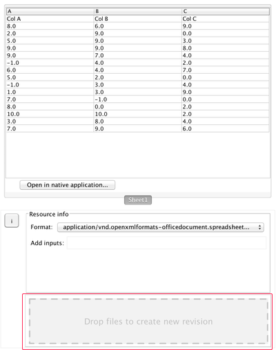

.. _doc-folders-guide:

*****************
Files and Folders
*****************

Ovation makes it easy to upload folders and files to the Ovation cloud. You can store Folders under any Ovation Project. Once uploaded, you can use the files and folders just as you would folders on your computer's hard drive but in Ovation, your Folders become even more powerful. Ovation automatically synchronizes Project files & folders with your collaborators. You can add annotations including Keyword Tags, Notes, and Properties, to folders. And you can add Analysis Records to folders that tie results in that folder to input files in any Project, Folder, or Experiment in your Ovation database.

Adding Files & Folders
======================

To add new files, or a folder tree containing files and/or nested folders, drag-and-drop the file(s)/folder(s) onto the appropriate drop zone in the Ovation desktop.

To a Project
------------

To add new file(s) or folder(s) to a Project, drag-and-drop the file(s) and/or folder(s) from the Finder (OS X) or Windows Explorer (Windows) onto the "Drop files to upload" zone in the Project info window.

    
    Drop files or folders onto a Project "Drop files to upload" zone to upload new file(s) or folder(s).
    
    
To add a new empty Folder to a Project, click the "+New Folder" link in the Project info window.

To a Folder
-----------

To add new file(s) or folder(s) to an existing Folder, drag-and-drop the file(s) and/or folder(s) from the Finder (OS X) or Windows Explorer (Windows) onto the "Drop files to upload" zone in the Folder info window.

    
    Drop files or folders onto a Folder's "Drop files to upload" zone to upload new file(s) or folder(s).
    
    
To add a new empty Folder to a Folder, click the "+New Folder" link in the Folder info window.

Moving Files & Folders
======================

You can drag-and-drop files or folders within the Projects Navigator to move them to an other folder. You can also copy file or folder to an other folder using your computer's copy-gesture during drag (the ``Alt`` key on Windows or ``Option`` key on OS X).

    
    Drag-and-drop file(s) or folder(s) to move them within Ovation.

File Revisions
==============

Ovation tracks each version of stored files. Ovation does not automatically upload a new version of a file if you modify it locally, but you can choose to upload a new version any time. If you modify a file and want to upload the new version, select "Save Version" from the file's context menu.

.. figure:: _static/save_version.png
    :align: center
    
    To save and upload a new file revision, select "Save Version" from the file's context menu in the Ovation Desktop app.
    
    
You can also drag-and-drop the new revision onto the file's info window.

    
    File info panel showing drop zone for uploading a new revision of the displayed file.
