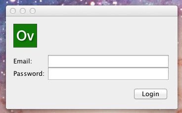
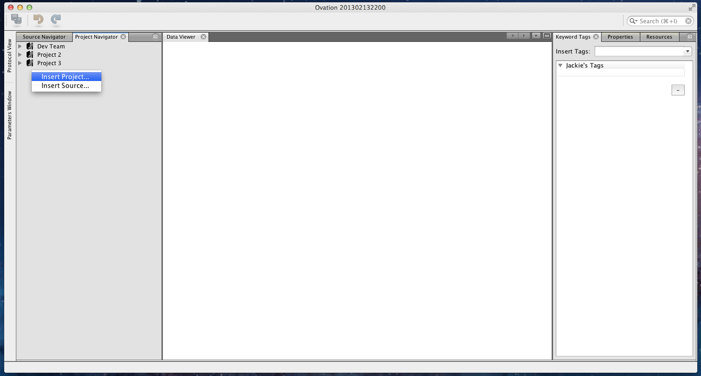
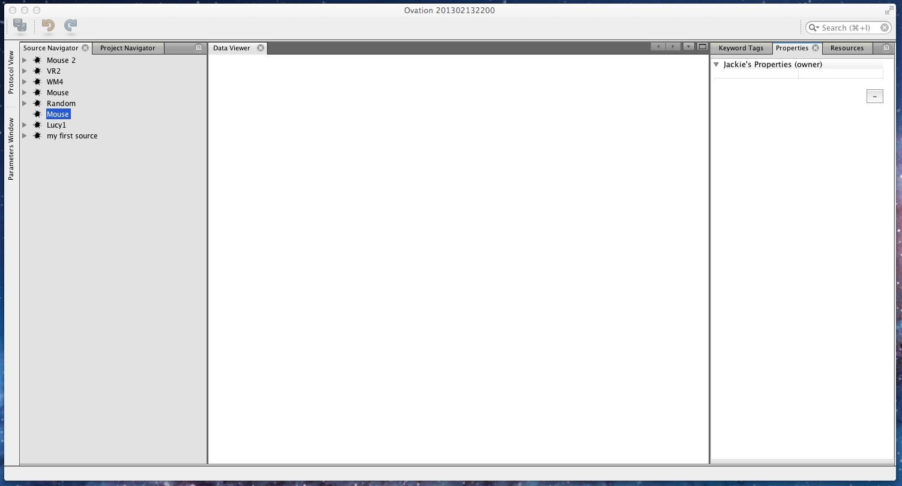
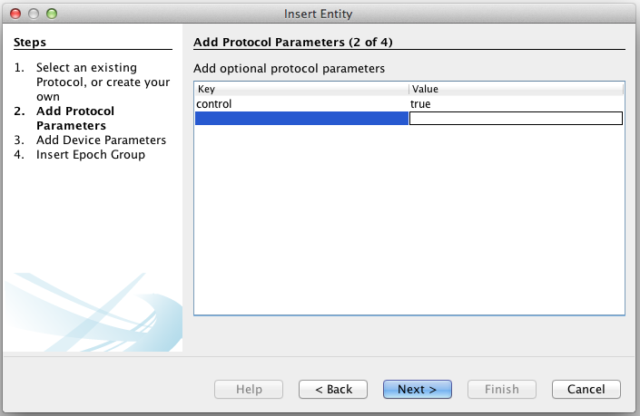
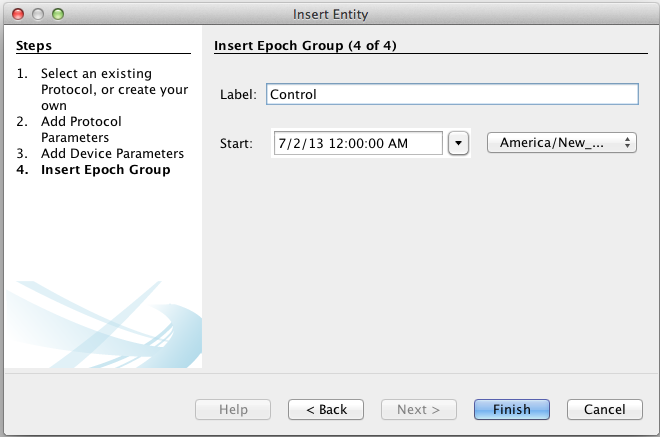
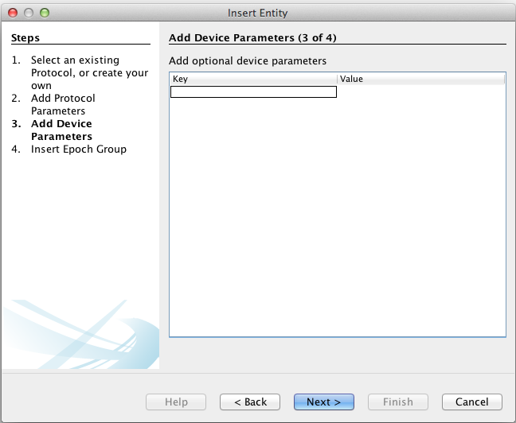
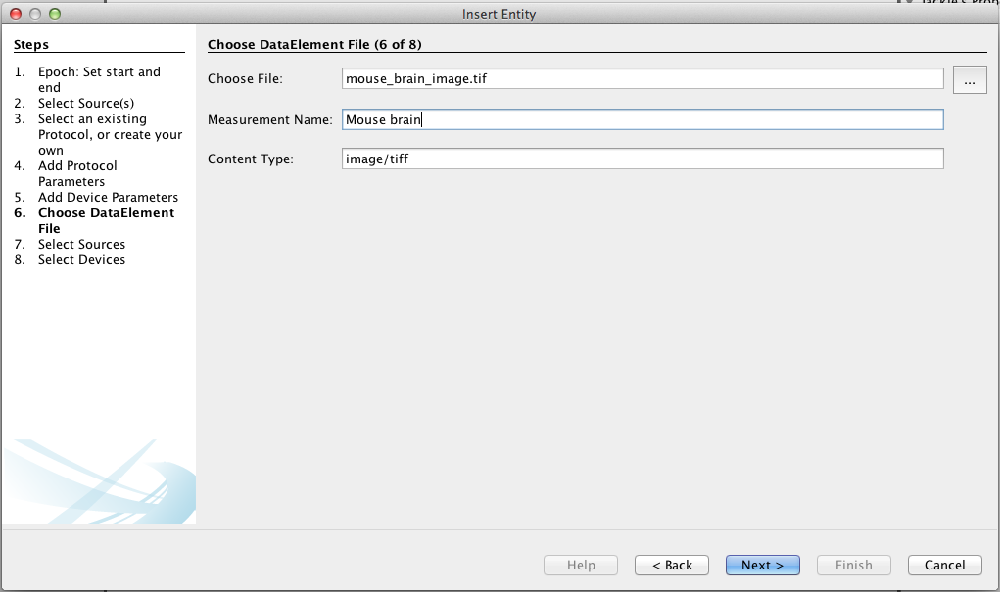

***************
Getting Started
***************

Once you've :ref:`installed <doc-installation>` Ovation, you're ready to start organizing your data. Ovation organizes data using entities ("nouns") that are familiar to scientists: Projects, Experiments, Protocols, Measurements, etc. Each instance of these (and other) entities stored in the are called "objects".

.. sidebar:: Object identity

    Every object in the Ovation database has a unique identity—a globally unique identifier such as `C3617DF6-3296-434E-890D-4AA730A80431`.

This tutorial will demonstrate adding numeric, image and tabular `Measurements` to a new `Project`.

Authentication
==============

Before you can add data to your Ovation database, you must login using your email address and `ovation.io`_ password.

.. note:: If you've forgotten your `ovation.io`_ password, you can `reset <https://ovation.io/users/password/new>`_ it.

.. _sec-new-project:

Adding a new `Project`
======================

This section shows you how to add a new `Project` object to the database. Projects are top-level entities in the Ovation data model, and are used to organize Experiment data. Projects may contain many Experiments, and Experiments can belong to many Projects. 

To add a new `Project`, right click on the Ovation browser window and select 'Insert Project..'. 

.. figure:: _static/insert_project_wizard1.png

Follow the wizard to set the name, start time, and purpose for your Project. The purpose may be as general or specific as you want, although it generally should correspond to the hypothesis being tested in this Project.

.. figure:: _static/full_screen_after_project1.png

Now that we have inserted a Project, it's time to start adding Sources to the Project.

.. _sec-new-source

Adding a new `Source`
=====================

In life sciences, Sources can be thought of as the biological subject of an experiment. They are explicitly associated with the Epochs (or trials) they are involved in, and there can be many Sources associated with an Epoch. The Source object in the Ovation data model serves as the place to store any information that pertains to that Source, regardless of the conditions of an experiment it was involved in. 

.. figure:: _static/insert_source.png

Let's insert a Source object, by switching our view to the Source Navigator, and right clicking in the browser window. 

.. figure:: _static/insert_source_wizard1.png

Here, I've given the Source a name of 'Mouse', and an id corresponding to the id in my animal database.

.. figure:: _static/source_view_with_two_mouse_sources.png

Since I've created two sources with the same label (Mouse), I should add some properties to them to distinguish them for myself. I will do this by selecting my newly created Source, and switching to the properties view on the right of my screen.

Here, I'll add a few things that I know about this source.

.. figure:: _static/source_with_properties.png 

Now that we've created the Source object that we'll use for the Experiment data we will add, we should add the Experiment.

.. _sec-new-experiment

Adding an `Experiment` of data
==============================

Experiments are entities in the Ovation data model that contain a number of trials (called Epochs), organized into a hierarchy of trial groups (called EpochGroups). Conceptually, you should use EpochGroups to group Epochs in a way thats meaningful to your experimental protocol. Raw data is then added to Epochs in the form of Measurements.

Experiments also contain the general setup and protocol information for all of the Epochs (or trials) contained in the Experiment. Information about the equipment used, including make, model, software version, as well as global settings of that equipment all belong in the EquipmentSetup entity attached to the Experiment. Information about the protocol for the Experiment belongs in the Protocol entity attached to this Experiment. Both the protocol and equipment setup information can be added after the fact, so we will not add it now.

.. figure:: _static/insert_experiment1.png

To add a new `Experiment`, right click on a Project entity, and select 'Insert Experiment...'

.. figure:: _static/insert_experiment_wizard1.png

.. _sec-new-epoch-groups

Now, lets add a couple EpochGroups to this experiment. Below, I'll add two EpochGroups, one labeled 'Control', and the other labeled 'Test'. To add an EpochGroup, right click the Experiment you just created, and select 'Insert EpochGroup...'. 

.. figure:: _static/insert_control_protocol_wizard3.png

The first three panels of the wizard are related to an EpochGroup protocol. You may select an existing protocol at this stage, create a new one, or choose not to select one. I will choose to create a protocol named 'Demo Protocol' by clicking on the plus button. Then I will edit the corresponding text box, to add my protocol document text. On the next panel, I will choose to add the protocol parameters {control, true}, because this is the protocol for my 'control' EpochGroup. I have no device parameters at this time, so I'll leave that table blank.

The last panel contains the information for the EpochGroup object. I will set the label to 'Control' to indicate that all the Epochs found in this EpochGroup are control trials. 

I will then create another EpochGroup with label 'Test'. Again, the labeling of 'Control' and 'Test' are arbitrary, I chose them because it fit my experiment structure. 

.. figure:: _static/epoch_groups_inserted.png

We are now ready to add the data to our Experiment!

.. _sec-new-data

Adding Data
===========

Adding data is a two part process. First, we create an Epoch object. Each Epoch represents an event that happened during a specific time, involving a set of Sources. The next step is to add one or many Measurements to the newly created Epoch. To begin, right click on the 'Control' EpochGroup and select 'Insert Measurement...'. This wizard will create an Epoch object with one Measurement object. You may optionally add more measurements to the Epoch object after it has been created. 

.. figure:: _static/insert_epoch_wizard1.png
.. figure:: _static/select_source_wizard1.png
.. figure:: _static/select_source_wizard2.png

I skipped the protocol information this time, but... explain about optional source names, and device names

.. _ovation.io: http://ovation.io
