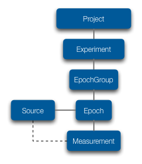
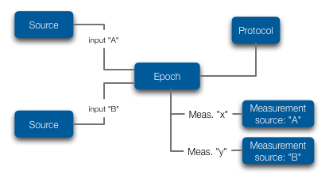
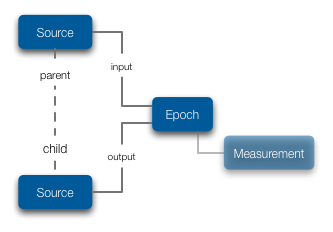

.. _doc-procedure-guide:

************************
Protocols and Procedures
************************

``Protocols`` describe a ``Procedure`` for making a *Measurement*, creating a new *Source* or performing an *Analysis*. Ovation *Protocol* objects may contain written textual description or a reference to computer code that describes the protocol. They may also contain a reference to computer code describing the process. Each *Protocol* should be represented only once in the Ovation database, even if the *Procedure* it describes is performed many times.

A *Procedure* references the *Protocol* object and stores *protocol parameter* values, the values of any *variables* in the *Procedure* description such as reagent concentration, lot number, time intervals, etc.

.. _sec-procedures-measurements:

Making Measurements
===================

Ovation's data model contains a number of *Procedure* elements that describe how *Measurement(s)* are made during an experiment. As shown in the :ref:`Expanded Structural Model <fig-expanded-data-model>` *Measurements* are made during an ``Experiment``. An *Experiment* may be subdivided into one or more *Epochs*. An ``Epoch`` represents a segment of the experimental timeline with a known start and end time. In trial-based experiments, each trial is one *Epoch*. *Epochs* may be (optionally) grouped into ``EpochGroups`` to describe the experimental structure. In a trial-based experiment, *EpochGroups* would represent blocks of trials, such as "control", "treament" and "recovery" blocks of a pharmacological study.

.. _fig-expanded-data-model:

   
   **Expanded Structural Data Model**
   
*Epochs* deserve a bit of special attention because they represent Ovation's "unit of scientific work". During an *Epoch* a procedure is performed, one or more named *Measurements* are made and/or one or more *Sources* are derived. 

   
   **Epoch Data Model**

An *Epoch* contains references to the *Sources* from which *Measurements* were made during that epoch (the "input sources"). Each input source may have a name within the *Epoch*. For example, a mouse in a behavioral experiment may have a *Source* identifier of **xyz123**, but within an *Epoch* of a behavioral experiment be referred to as the **subject** within the *Epoch's* protocol. Each *Measurement* references one or more of its *Epoch's* input sources by name to denote from which of the *Epoch's* input sources were the *Measurement's* data were taken.

Each of the ``Epoch > EpochGroup > Experiment`` elements may be associated with a *Protocol*. It's up to you to determine where it makes most sense to attach the protocol for your experiment. If you have a protocol that describes the entire experiment, it makes sense to attach it at the ``Experiment``. If you have a potentially different protocol describing the measurements made in each Epoch, the ``Protocol(s)`` should be associated with the ``Epochs``.

    
    **Source Derivation**

Source derivation
=================
    
Top-level ``Source`` objects in Ovation should represent individuals (animals, humans etc.). What about experiments performed on a derived tissue or an other "part" of a *Source*? In Ovation these "derived" *Sources* are children of their *parent* *Source*. Ovation can record information about the *Protocol* used to derive children *Sources* from their parent(s). Ovation stores an *Epoch* that describes the derivation procedure. The *parent* *Sources* are the input sources to this *Epoch* and the derived children *Sources* are the output sources of this *Epoch*. Any quality control or other *Measurements* made during the procedure may be recorded as *Measurements* on this *Epoch* as well.

Analysis Records
================

:ref:`AnalysisRecords <doc-analysis-records-guide>` also have a *Protocol*. Instead of describing how a *Measurement* is made, an *AnalysisRecord's* *Protocol* describes how the analysis was performed—the procedure for deriving the results from the inputs.

.. figure:: ../_static/protocol-analysisrecord.png
    :align: left
    
    **Analysis procedure is described by a Protocol**
    
It is common for *AnalysisRecords'* *Protocol* to be described by computer code (e.g. R or Python code) which can be referenced by the URL and revision of the code in a source repository (e.g. `GitHub <http://github.com>`_).

