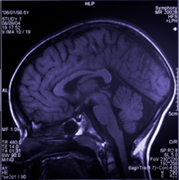
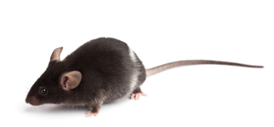

.. _doc-source-guide:

*************
Sources Guide
*************

``Sources`` represent the subjects of experimental measurements. For example, each patient in a clinincal trial would be represented by a single ``Source`` object. Likewise each mouse in a laboratory study or each field site in a field ecology study would be represented by a single ``Source`` object. 

    

``Source`` objects are identified by a descriptive label and an identifier. Descriptive labels are commonly used to describe the type of ``Source`` (e.g. BL6 to describe a mouse's background, or a clinical patient's name) and the identifier is used to uniquey identify the ``Source`` (e.g. an animal's identifier in a facility database, a patient's clinical patient record number, etc.).

Metadata
========

Metadata about the entity reprsented by a ``Source`` object such as sex, birth date, genus, species, genetic background, location, etc. may be stored as :ref:`Properties <sec-property-annotations>`.

Derived Sources
===============

