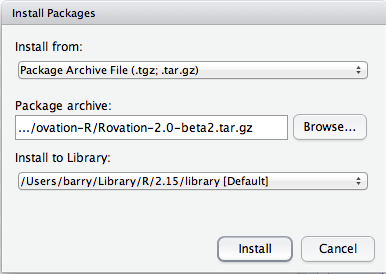

=======================
Selected Data Importers
=======================

This page describes usage of selected Ovation data import plugins.

Fenton Lab .dat Data
====================

The Fenton Lab dat import script is a trio of Matlab functions. The top-level function is `import_fenton_dat`. The `import_fenton_dat` script requires the :ref:`Ovation Matlab API <sec-matlab-installation>`.

1. Add a Project and Experiment to the databse (if needed)
2. Set the Experiment equipment setup::

    >> exp.setEquipmentSetup(config2map('<cfg file>', 'Arena'))

    
.. note::
    You may choose a different equipment prefix than `Arena` if you choose. Whatever you choose, you'll need to use the same name later when calling `import_fenton_dat`

3. Create an EpochGroup within the new Experiment for the behavioral data
4. Retrieve a reference to the `EpochGroup`, `Source` and `Protocol` for the data. You can browse from the `DataContext` in Matlab or copy-and-paste from the Ovation application, using `getObjectWithURI` from the Matlab `DataContext`, e.g.::

    >> source = context.getObjectWithURI('<pasted URI from Ovation application>');
    >> protocol = context.getObjectWithURI('<pasted URI from Ovation application Protocols View>');
    >> epochGroup = context.getObjectWithURI('<pasted URI from Ovation application>');

4. Import the room-frame and arena-frame .dat and image files. This example shows an import of the `bl1D1Hab` trial::

    >> epoch = import_fenton_dat(source, epochGroup, protocol, 'Arena', 'Arena.Camera', 'America/New_York', 600, 'bl1D1Hab_Arena.dat', fullfile(pwd(), 'bl1D1Hab_Arena.png'), 'bl1D1Hab_Room.dat', fullfile(pwd(), 'bl1D1Hab_Room.png'), 'image/png')
    
.. note:: 
    You must provide the *abolute* path (i.e. from the file-system root) to the image files. Because Matlab does not change the JVM's working directory when changing Matlab working directories, there is no way to calculate the absolute path in code. You can use `fullfile(pwd(), <relative path>)` to create an absolute path.

6. Additional table (e.g. CSV) data can be imported using the "Insert Measurement..." wizard in the Ovation application::

    >> epoch.insertMeasurement('<table name>', ...
        array2set({'subject'}), ...
        array2set({'Arena'}), ...
        java.util.File('<absolute path to .csv>').toURI().toURL(), ...
        'application/csv'... % or other appropriate content type
        )

.. pClamp ABF
.. ==========
.. 
.. The Ovation pClamp (ABF) importer is a command-line tool
.. 
.. 1. If needed, install Python 2.7 (download from http://python.org)
.. 2. Install the Python `setuptools` package. Download and run `ez_setup.py <http://peak.telecommunity.com/dist/ez_setup.py>`_:
.. 
..     python ez_setup.py
..     
.. 3. If needed, install the ovation-api and ovation python modules. Download the ovation-api and install with `easy_isntall`:
.. 
..     easy_install ovation-

Import CSV via the R API
========================

1. Install the `Rovation package <http://ovation.io/downloads>`_.

    
    Rstudio package installation window. Select Install From "Package Archive", then choose the path to the Rovation package downloaded from http://ovation.io. Click "Install" to install `Rovation`
    
2. Load the `Rovation` library within R::

    > library(Rovation)
    
3. Follow the example import making use of the R API and the Ovation application::

    ## Connect to the database
    context <- NewDataContext("<registered email>")

    ## Create a new Protocol
    protocol <- context$insertProtocol("R protocol", "... my protocol document ...")

    ## Or a protocol load one via URI
    protocol <- context$getObjectWithURI('<URI copied from Ovation application>')

    ## Get a reference to a Source and Epoch container (e.g. an EpochGroup)

    source <- context$getObjectWithURI('ovation://1ce7d897-db87-4a66-aab9-65898e2cddc9/')
    epochGroup <- context$getObjectWithURI('ovation://7271a95c-4b91-4e09-a48e-1cf510332ffb/')

    ## Insert a new Epoch
    protocolParameters <- list(param1 = "value1", param2 = 3, param3 = "some text")
    deviceParameters <- list() # Add device parameters here
    inputSources = list(subject=source) # Map of input sources
    outputSources - list() # No new sources generated by this Epoch
    epoch <- epochGroup$insertEpoch(List2Map(inputSources), 
                                    List2Map(outputSources),
                                    Datetime(year=2013, month=7, day=6), 
                                    Datetime(year=2013, month=7, day=7), 
                                    protocol, 
                                    List2Map(protocolParameters), 
                                    List2Map(deviceParameters))

    ## Add a CSV measurement
    measurement <- epoch$insertMeasurement("table1", # Measurement name
                                           Vector2Set(c("subject")), # Note same name as inputSources above
                                           Vector2Set(c("device1", "device2")), # Device(s) used to make measurement. Should be present (or added) in Experiment$getEquipmentSetup
                                           NewUrl("/path/to/example.csv"),
                                           "application/csv"
                                           )

    # Wait (up to 60 minutes) for all uploads to finish
    fs <- context$getFileService()
    TimeUnit <- J("java.util.concurrent.TimeUnit")
    Long <- J("java.lang.Long")
    fs$waitForPendingUploads(new(Long, "60"), $MINUTES)
  

    ## Retrieve the DataFrame from measurement
    # The pattern for downloading (if ncessary) and accessing the local cached copy of measurement's data
    localFilePath <- measurement$getLocalDataPath()$get()

    df <- read.csv(localFilePath)
    

