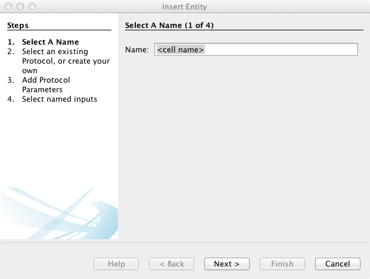
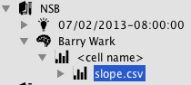

=======================
Selected Data Importers
=======================

This page describes usage of selected Ovation data import plugins.

Fenton Lab .dat Data
====================

The Fenton Lab dat import script is a trio of Matlab functions. The top-level function is `import_fenton_dat`. The `import_fenton_dat` script requires the :ref:`Ovation Matlab API <sec-matlab-installation>`.

1. Add a Project and Experiment to the databse (if needed)
2. Set the Experiment equipment setup::

    >> exp.setEquipmentSetup(config2map('<cfg file>', 'Arena'))

.. note::
    You may choose a different equipment prefix than `Arena` if you choose. Whatever you choose, you'll need to use the same name later when calling `import_fenton_dat`

3. Create an EpochGroup within the new Experiment for the behavioral data
4. Retrieve a reference to the `EpochGroup`, `Source` and `Protocol` for the data. You can browse from the `DataContext` in Matlab or copy-and-paste from the Ovation application, using `getObjectWithURI` from the Matlab `DataContext`, e.g.::

    >> source = context.getObjectWithURI('<pasted URI from Ovation application>');
    >> protocol = context.getObjectWithURI('<pasted URI from Ovation application Protocols View>');
    >> epochGroup = context.getObjectWithURI('<pasted URI from Ovation application>');

4. Import the room-frame and arena-frame .dat and image files. This example shows an import of the `bl1D1Hab` trial::

    >> epoch = import_fenton_dat(source, epochGroup, protocol, 'Arena', 'Arena.Camera', 'America/New_York', 600, 'bl1D1Hab_Arena.dat', fullfile(pwd(), 'bl1D1Hab_Arena.png'), 'bl1D1Hab_Room.dat', fullfile(pwd(), 'bl1D1Hab_Room.png'), 'image/png')

.. note::
    You must provide the *abolute* path (i.e. from the file-system root) to the image files. Because Matlab does not change the JVM's working directory when changing Matlab working directories, there is no way to calculate the absolute path in code. You can use `fullfile(pwd(), <relative path>)` to create an absolute path.

6. Additional table (e.g. CSV) data can be imported using the "Insert Measurement..." wizard in the Ovation application::

    >> epoch.insertMeasurement('<table name>', ...
        array2set({'subject'}), ...
        array2set({'Arena'}), ...
        java.util.File('<absolute path to .csv>').toURI().toURL(), ...
        'application/csv'... % or other appropriate content type
        )

pClamp
======

Axon Binary Format (.abf)
-------------------------

The Ovation pClamp (ABF) importer is a command-line tool

1. If needed, install Python 2.7 (download from http://python.org)
2. If needed, install the Python `setuptools` package. Download and run `ez_setup.py <http://peak.telecommunity.com/dist/ez_setup.py>`_::

    python ez_setup.py

3. Install the :ref:`Ovation Python API <sec-python-installation>` and the Ovation Neo Importer::

    easy_install ovation-neo

The physiology data importer is run from the terminal command line::

    python -m ovation_neo --timezone <time zone ID> --container <experiment URI> --protocol <protocol URI> --source <source URI> file1.abf file2.plx...

You can get more information about the available arguments by running::

    python -m ovation_neo -h

To find the `Experiment`, `Protocol` and `Source` URIs, you can copy-and-paste the relevant object(s) from the Ovation application or call the `getURI())` method on the object within Python.

Clampfit (.atf)
---------------

Post-experiment analysis are stored as `AnalysisRecords` in Ovation. These instructions describe adding an `AnalysisRecord` with a single Clampfi analysis as the analysis output.

1. Export the analysis from Clampfit as an `.atf` file. The `.atf` format is really tab-delimited text

2. Open the .atf file in Excel and re-save as Comma-separated value (CSV)

3. In the Ovation application, select the `Project` containing the raw traces used in the analysis. Right-click on this `Project` and select "Insert Analysis Record..."

4. Enter the name for the new `AnalysisRecord`. We recommend that you choose a descriptive name such as the subject's ID or the "name" of the cell that you recorded.

    Insert a new `AnalysisRecord` to hold the Clampfit analysis
    
5. Select the `Protocol` for this `AnalysisRecord`.

    Select the `Protocol` for the Clampfit analysis. You can create a new `Protocol` by entering the name of the new protocol and pressing the "+" button. If there are "variables" in the protocol that are set for each analysis, surround the variable name with curly braces (`{` and `}`) in the protocol document. For example, the a variable describing a detection threshold might be annotated as `{THRESHOLD_mV}` in the protocol document.
    
6. Enter any protocol parameters for this analysis (i.e. values for any variables in the protocol document)

.. figure:: _static/add-atf-analysisrecord3.png

    Enter protocol parameters for the analysis. For each variable in the analysis' protocol document (e.g. `{THRESHOLD_mV}`), you should enter a value here (e.g. key = `THRESHOLD_mV`, value = `1`).
    
7. Select the `Measurements` that were used in this analysis. From the Project browser, select the `EpochGroup` imported from the corresponding pClamp `.abf` file and press the "+" button to add `Measurements` from this `EpochGroup` to the `AnalysisRecord`. Press the "Finish Button" to add the Analysis Record.

.. figure:: _static/add-atf-analysisrecord4.png

    Select the `EpochGroup` imported from the corresponding pClamp `.abf` file and press the "+" button to add `Measurements` from this `EpochGroup` to the `AnalysisRecord`.
    
8. Right-click on the newly inserted Analsys Record in the Project Navigator and select "Insert Analysis Output...". In the wizard, press the "..." button and locate the CSV file generated in step 2 above. Note that we've entered "application/csv" for the "Content Type" of this analysis output. Press the "Finish" button to add the analysis output to the Analysis Record.

9. You can view the calculated slopes in the Ovation application data viewer (as well as open them in Excel) by selecting the analysis output (or the entire Analysis Record) in the Ovation Project Navigator.

    Select the newly inserted analsyis output (e.g. "slope.csv") or the entire Analysis Record to display the analysis results.

Import CSV via the R API
========================

1. Install the `Rovation package <http://ovation.io/downloads>`_.

.. figure:: _static/r_studio_install_package.png

    Rstudio package installation window. Select Install From "Package Archive", then choose the path to the Rovation package downloaded from http://ovation.io. Click "Install" to install `Rovation`.

2. Load the `Rovation` library within R::

    > library(Rovation)

3. Follow the example import making use of the R API and the Ovation application::

    ## Connect to the database
    context <- NewDataContext("<registered email>")

    ## Create a new Protocol
    protocol <- context$insertProtocol("R protocol", "... my protocol document ...")

    ## Or a protocol load one via URI
    protocol <- context$getObjectWithURI('<URI copied from Ovation application>')

    ## Get a reference to a Source and Epoch container (e.g. an EpochGroup) by copy-and-paste from the Ovation application

    source <- context$getObjectWithURI('<source URI>')
    epochGroup <- context$getObjectWithURI('<epochGroup URI>')

    ## Insert a new Epoch
    protocolParameters <- list(param1 = "value1", param2 = 3, param3 = "some text")
    deviceParameters <- list() # Add device parameters here
    inputSources = list(subject=source) # Map of input sources
    outputSources - list() # No new sources generated by this Epoch
    epoch <- epochGroup$insertEpoch(List2Map(inputSources),
                                    List2Map(outputSources),
                                    Datetime(year=2013, month=7, day=6),
                                    Datetime(year=2013, month=7, day=7),
                                    protocol,
                                    List2Map(protocolParameters),
                                    List2Map(deviceParameters))

    ## Add a CSV measurement
    measurement <- epoch$insertMeasurement("<measurement name>",
                                           Vector2Set(c("subject")), # Note same name as inputSources above
                                           Vector2Set(c("device1", "device2")), # Device(s) used to make measurement. Should be present (or added) in Experiment$getEquipmentSetup
                                           NewUrl("</path/to/example.csv>"),
                                           "application/csv"
                                           )

    # Wait (up to 10 minutes) for all uploads to finish
    WaitForPendingUploads(context, timeout.seconds = 600)

    ## Retrieve the DataFrame from measurement
    # The pattern for downloading (if ncessary) and accessing the local cached copy of measurement's data
    localFilePath <- measurement$getLocalDataPath()$get()

    df <- read.csv(localFilePath)

