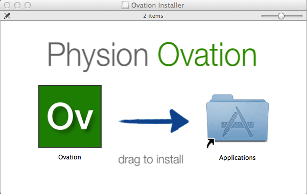
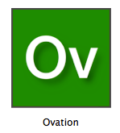

.. _doc-installation:

.. raw:: html

    

        <ul class="nav nav-pills" style="display: inline-block">
            <li class="active"><a href="installation.html">Install</a></li>
            <li><a href="create_project.html">Create a Project</a></li>
            <li><a href="create_experiment.html">Create an Experiment</a></li>
            <li><a href="create_measurement_and_source.html">Add a Measurement</a></li>
        </ul>
    

    
************
Installation
************

|Ovation(TM)| is a data management platform that helps researchers organize, track, search and share their data. Your data is stored in the cloud, but you get the added advantage of a local interface that will sync your activity and data seamlessly.  To get started with Ovation, sign up for an account on `ovation.io <http://ovation.io>`_. Once you've signed up for an account, you can download_ the Ovation application and get started.

.. _download: http://ovation.io/downloads

Requirements
============

Ovation supports the following operating systems and architectures:

* OS X 10.8 and later
* Windows 7 and later (64-bit)

Ovation requires the Java runtime (JRE) version 7 or later. Please download_ and install Java before installing Ovation.

Installation
============

To install the Ovation application, download the appropriate platform binary from `ovation.io <http://ovation.io>`_.

Mac OS X
--------

These instructions detail installation on Mac OS X 10.8 or later.

1. Open the installer disk image
2. Drag the Ovation application to the "Applications" folder

    To install Ovation, drag the Ovation application to the "Applications" folder.

3. Double-click the Ovation application in the "Applications/" folder

    Double-click the Ovation application in the "Applications/" folder to start Ovation

Windows
-------

These instructions detail installation on Windows 7 or later.

1. Double-click the "Ovation Installer.exe" to start the installation wizard.
2. Follow the on-screen steps to install Ovation
3. Open the Ovation application from the "Start" menu (Windows 7) or the "Start screen" (Windows 8)

.. |Ovation(TM)| unicode:: Ovation U+2122
