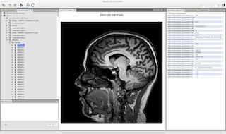

Introduction
============

Ovation is the revolutionary data management service that empowers researchers through the seamless organization of multiple data formats and sources, preservation of the link between raw data and analyses and the ability to securely share of all of this with colleagues and collaborators.

   

   Ovation in action

Organize
--------

Eliminate data silos that prevent researchers from seeing patterns across data sets. Ovation manages data from multiple data types and different file formats, all on one platform.

Track
-----

Follow and recall the evolution of projects from inception, through execution, to final output. Ovation easily maintains the connection between data, analysis and annotations from all members of a research team.

Share
-----

Increase productivity by seamlessly sharing data, annotations and analyses with colleagues. Share raw and analyzed data with colleagues in the lab or collaborators outside the institution while maintaining total control over what data is shared, with whom.
