.. _doc-getting-started:

*******************
Getting Started:  Create a Project
*******************

Once you've :ref:`installed <doc-installation>` Ovation, you're ready to start organizing your data. Ovation organizes data in a fashion familiar to scientists - projects, experiments, measurements, etc.  The best way to get started is to create a project.

Before you can add data to your Ovation database, you must login using your email address and `ovation.io`_ password.  Open Ovation and click "file" then "login".

.. figure:: _static/login_screen1.png
   :figwidth: 50%
.. :padding: 10px

.. note:: If you've forgotten your `ovation.io`_ password, you can `reset <https://ovation.io/users/password/new>`_ it.

.. _sec-new-project:

Create a new `Project`
######################

This section shows you how to add a new `Project` to the database. Projects are top-level entities in the Ovation data model, and are used to organize related Experiments. Projects may contain many Experiments, and Experiments can belong to more than one Project.

To add a new `Project`, right click on the "Project Navigator" browser window and select 'Insert Project..'.

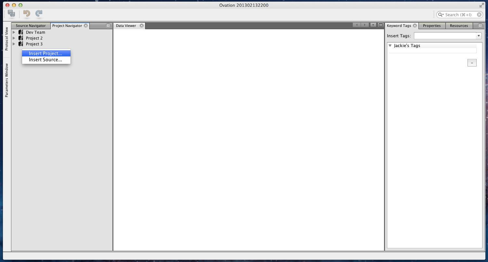

Follow the wizard to set the name, start time, and purpose for your Project.

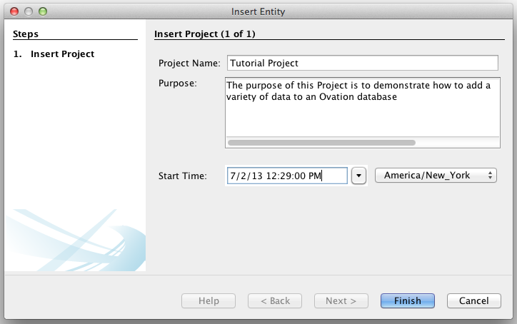

TIP:  If you do not see the new Project in the "Project Navigator" after finishing the project insertion wizzard, choose :menuselection:`Tools --> Reset Query` to refresh the display.

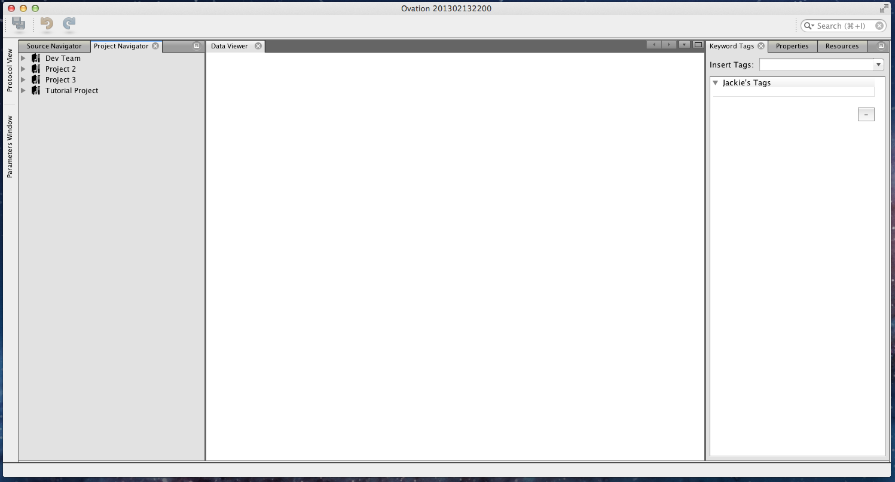

.. _sec-new-source:

Adding a new `Source`
#####################

Sources represent the subject of a Measurement. One or more Measurements are made within an Epoch, a region of time on the Experimental timeline during which a procedure was performed. Each Epoch has one or more named "Input Sources" and Measurements made during that Epoch may refer to these Sources by name, explcitly linking the Measurement to the Source(s).

Epochs may also have "Output Sources", new Sources that are derived from the Epoch's input Sources. For example, a Source representing an individual cell might be the output of an Epoch in which the Source object representing the source tissue for the cell was disassociated into individual cells. A Measurement made from this newly disassociated cell would be associated with the Source object representing that cell. That Source object would be linked in the Ovation database to its "parent" Source object (representing the tissue), which may in turn might be linked to a "parent" Source representing the subject from which that tissue was harvested.

.. tip::
    You may want to store additional information about the individual, such as sex, birth date, etc. as annotations on the Source object.

Insert a Source object by right-clicking in the "Source Navigator" and choosing :guilabel:`Insert Source...`:

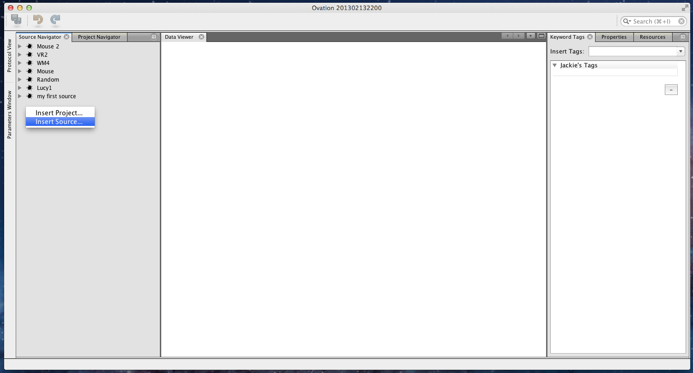

Enter the Source's label (the displayed name of the Source) and its identifier (e.g. an identification number within an animal facility database or in an other subject registration system).

.. figure:: _static/insert_source_wizard1.png
   :width: 60%

   Entering information for a new Source object. Here, the Source is given a label 'Mouse', and an identifier corresponding to the ID of the mouse in an external animal database.

You may want to store additional information about the individual, such as sex, birth date, etc. as annotations on the Source object. To add annotations to the newly created Source, select the Source in the "Source Navigator" window and enter the annotations in the "Properties View" window (on the right side of the screen):

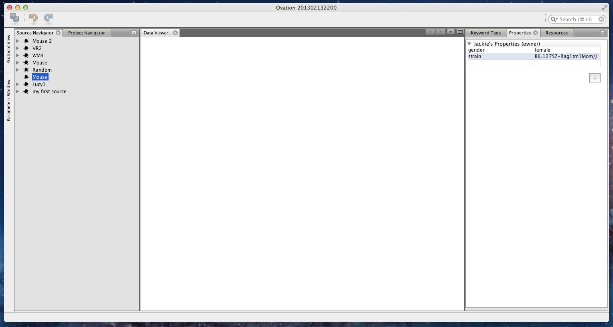

.. _sec-new-experiment:

Adding `Experiment` data
######################################

Experiments are entities in the Ovation data model that contain a number of Epochs, optionally organized into a hierarchy of groups (called EpochGroups). Conceptually, you should use EpochGroups to group Epochs in a way thats meaningful to your experimental protocol. Raw data is then added to Epochs in the form of Measurements.

Adding an Experiment
====================

Experiments also contain the general setup and protocol information for all of the Epochs (or trials) contained in the Experiment. Information about the equipment used, including make, model, software version, as well as global settings of that equipment all belong in the EquipmentSetup entity attached to the Experiment. Information about the protocol for the Experiment belongs in the Protocol entity attached to this Experiment. Both the protocol and equipment setup information can be added after the fact, so we will not add it now.

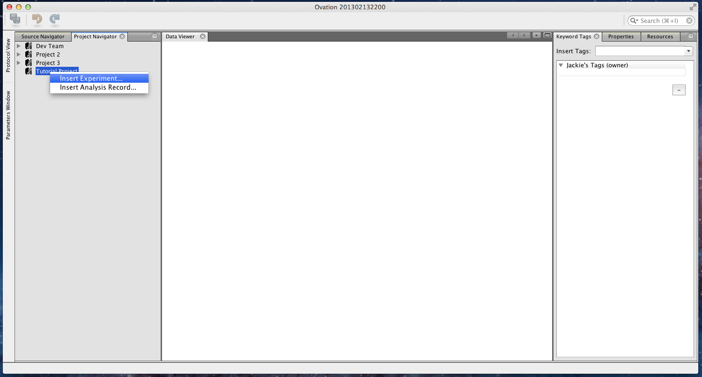

To add a new `Experiment`, right click on a Project entity, and select 'Insert Experiment...'

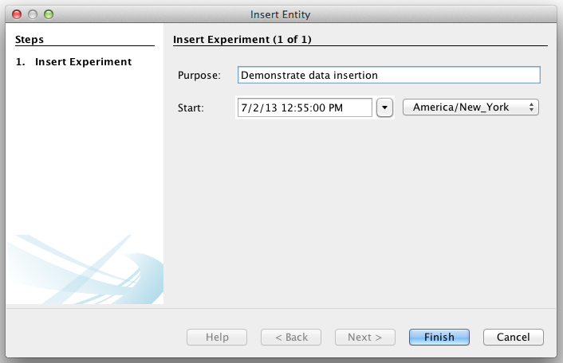

.. _sec-new-epoch-groups:

Now, lets add a couple EpochGroups to this experiment. Below, I'll add two EpochGroups, one labeled 'Control', and the other labeled 'Test'. To add an EpochGroup, right click the Experiment you just created, and select 'Insert EpochGroup...'.

+----------------------------------------------------------+----------------------------------------------------------+-----------------------------------------------------------+
| .. figure:: _static/insert_control_protocol_wizard1.png  | .. figure:: _static/insert_control_protocol_wizard2.png  |  .. figure:: _static/insert_control_protocol_wizard3.png  |
+----------------------------------------------------------+----------------------------------------------------------+-----------------------------------------------------------+

The first three panels of the wizard are related to an EpochGroup protocol. You may select an existing protocol at this stage, create a new one, or choose not to select one. I will choose to create a protocol named 'Demo Protocol' by typing 'Demo Protocol' in the text box below, and clicking on the plus button. Then I will edit the corresponding text box, to add my protocol document text. On the next panel, I will choose to add the protocol parameters {control, true}, because this is the protocol for my 'control' EpochGroup. I have no device parameters at this time, so I'll leave that table blank.

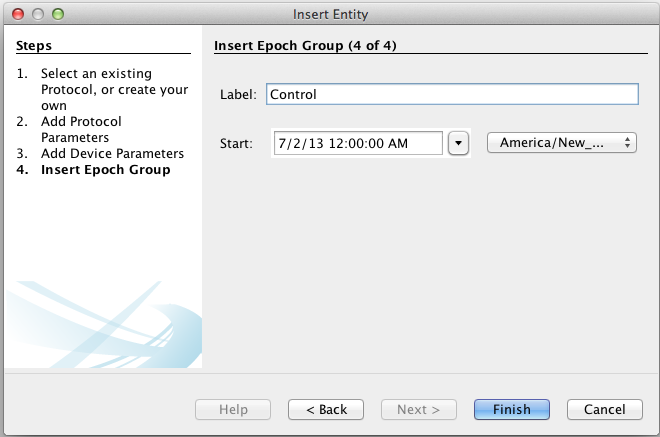

The last panel contains the information for the EpochGroup object. I will set the label to 'Control' to indicate that all the Epochs found in this EpochGroup are control trials.

+-------------------------------------------------------+-------------------------------------------------------+--------------------------------------------------------+
| .. figure:: _static/insert_test_protocol_wizard1.png  | .. figure:: _static/insert_test_protocol_wizard2.png  |  .. figure:: _static/insert_test_protocol_wizard3.png  |
+-------------------------------------------------------+-------------------------------------------------------+--------------------------------------------------------+

I will then create another EpochGroup with label 'Test'. Again, the labeling of 'Control' and 'Test' are arbitrary, I chose them because it fit my experiment structure.

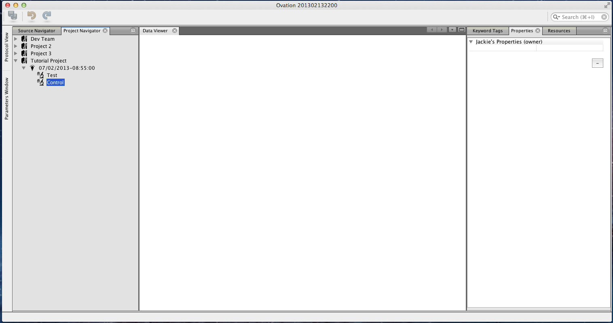

We are now ready to add the data to our Experiment!

.. _sec-new-data:

Adding Data
===========

Adding data is a two part process. First, we create an Epoch object. Each Epoch represents an event that happened during a specific time, involving a set of Sources. The next step is to add one or many Measurements to the newly created Epoch. To begin, right click on the 'Control' EpochGroup and select 'Insert Measurement...'. This wizard will create an Epoch object with one Measurement object. You may optionally add more measurements to the Epoch object after it has been created.

Step 1 contains the start and end time for the Epoch.

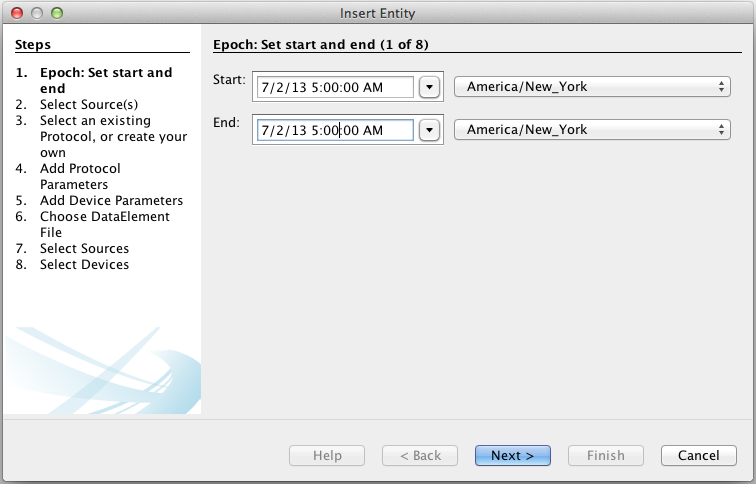

Step 2 allows you to select the sources that are present during this Epoch. For this example, I will add the Source I created earlier, by selecting it on the left, and clicking the + button.

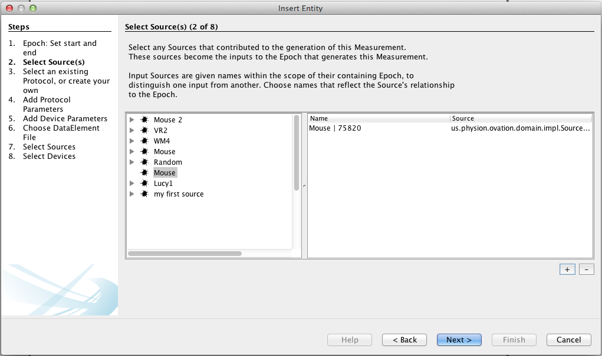

Sources are named within the scope of the Epoch. If you don't set a name, the default is created of the form 'label | id'. However, I'd like to rename the Source 'first mouse'.

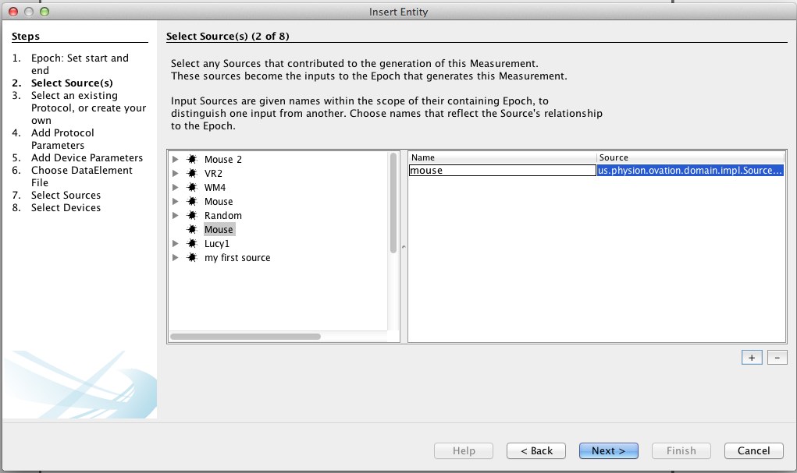

Steps 3-5 correspond to the protocol for this Epoch. I've chosen to skip that information, because my EpochGroup protocol document contains all the information I need.

Step 6 is where I choose the data file to add. I chose to add an image here, but I could have chosen a csv file, or any other single file of data. For image formats that contain important metadata or span multiple files, choose 'Insert Image...' instead of 'Insert Measurement...'.

.. figure:: _static/insert_meausrement_image.png
   :figwidth: 60%

The next two steps allow you to select which among the sources and devices associated with the Epoch should be associated with this particular measurement. By default, all sources and devices are associated with all measurements; however, if a measurement is associated with just one source, or just one device, you may uncheck the irrelevant sources and devices here. Since I have not added any devices to this Experiment's EquipmentSetup, my device list below is empty.

+------------------------------------------------------------+------------------------------------------------------------------+
| .. figure:: _static/insert_meausrement_select_sources.png  | .. figure:: _static/insert_meausrement_select_empty_devices.png  |
+------------------------------------------------------------+------------------------------------------------------------------+

Great, we have now inserted our first Measurement! Follow either the 'Insert Measurement...', 'Insert Numeric Measurement...', or 'Insert Image...' wizards to insert more data.

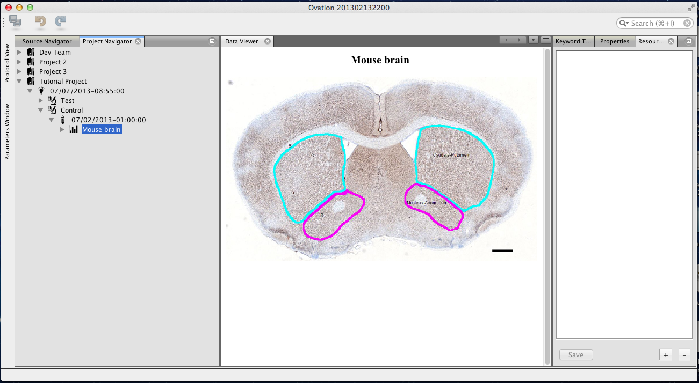

.. _ovation.io: http://ovation.io
