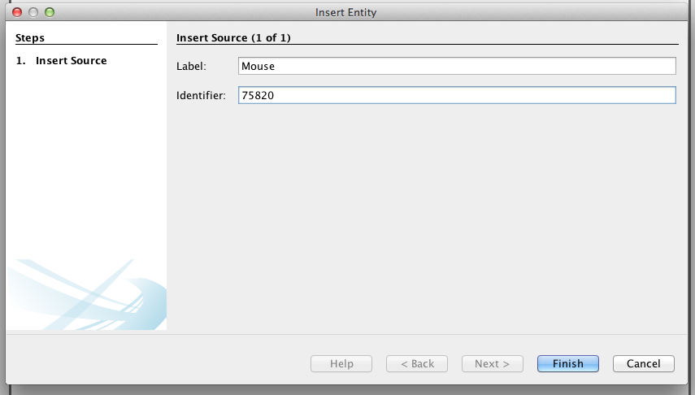

.. _doc-getting-started:

*******************
Getting Started:  Create a Project
*******************

Once you've :ref:`installed <doc-installation>` Ovation, you're ready to start organizing your data. Ovation organizes data in a fashion familiar to scientists - projects, experiments, measurements, etc.  The best way to get started is to create a project.

Before you can add data to your Ovation database, you must login using your email address and `ovation.io`_ password.  Open Ovation and click "file" then "login".

.. figure:: _static/login_screen1.png
   :figwidth: 50%
.. :padding: 10px

.. note:: If you've forgotten your `ovation.io`_ password, you can `reset <https://ovation.io/users/password/new>`_ it.

.. _sec-new-project:

Create a `Project`
######################

This section shows you how to add a new `Project` to the database. Projects are top-level entities in the Ovation data model, and are used to organize related Experiments. Projects may contain many Experiments, and Experiments can belong to more than one Project.

To add a new `Project`, right click on the "Project Navigator" browser window and select 'Insert Project..'.

.. image:: _static/full_screen_before_project_insert_project1.png
   :width: 60%

Follow the wizard to set the name, start time, and purpose for your Project.

TIP:  If you do not see the new Project in the "Project Navigator" after finishing the project insertion wizzard, choose :menuselection:`Tools --> Reset Query` to refresh the display.

.. _sec-new-experiment:

Create an `Experiment`
######################################

Now that you have created a Project, you can create individual Experiments within that Project.  Experiments will contain all the measurements collected or trials conducted as part of that specific Experiment.  Experiments can also contain the general setup and protocol information for these same Measurement and trials.  

TIP:  Information about the equipment used, including make, model, software version, as well as global settings of that equipment all belong in the EquipmentSetup entity attached to the Experiment. Information about the protocol for the Experiment belongs in the Protocol entity attached to this Experiment. Both the protocol and equipment setup information can be added after the fact, so we will not add it now.

To add a new `Experiment`, right click on a Project entity, and select 'Insert Experiment...'

We are now ready to add the data to our Experiment!

.. _sec-new-data:

Create a Measurement and add a Source
===========

Now it's time to add data to our Experiment.  This is done by creating a Measurement and subsequently attaching that Measurement to the Source or subject on which it was performed (cell line, animal, tissue sample, etc).  To begin, right click on the Experiment and select 'Insert Measurement...'. This wizard will create a trial with one Measurement. You may optionally add more measurements to this same trial after it has been created.

Step 1 contains the start and end time for the Epoch.

Step 2 allows you to select the sources that are present during this Epoch. For this example, I will add the Source I created earlier, by selecting it on the left, and clicking the + button.

.. figure:: _static/select_source_wizard1.png
   :figwidth: 60%

Sources are named within the scope of the Epoch. If you don't set a name, the default is created of the form 'label | id'. However, I'd like to rename the Source 'first mouse'.

.. figure:: _static/select_source_wizard2.png
   :figwidth: 60%

Steps 3-5 correspond to the protocol for this Epoch. I've chosen to skip that information, because my EpochGroup protocol document contains all the information I need.

Step 6 is where I choose the data file to add. I chose to add an image here, but I could have chosen a csv file, or any other single file of data. For image formats that contain important metadata or span multiple files, choose 'Insert Image...' instead of 'Insert Measurement...'.

.. figure:: _static/insert_meausrement_image.png
   :figwidth: 60%

The next two steps allow you to select which among the sources and devices associated with the Epoch should be associated with this particular measurement. By default, all sources and devices are associated with all measurements; however, if a measurement is associated with just one source, or just one device, you may uncheck the irrelevant sources and devices here. Since I have not added any devices to this Experiment's EquipmentSetup, my device list below is empty.

+------------------------------------------------------------+------------------------------------------------------------------+
| .. figure:: _static/insert_meausrement_select_sources.png  | .. figure:: _static/insert_meausrement_select_empty_devices.png  |
+------------------------------------------------------------+------------------------------------------------------------------+

Great, we have now inserted our first Measurement! Follow either the 'Insert Measurement...', 'Insert Numeric Measurement...', or 'Insert Image...' wizards to insert more data.

.. _sec-new-source:

Add a `Source`
#####################

Sources represent the subject of a Measurement. A Source may be a cell line, tissue, specific animal or any other object from which you have taken a measurement.

.. tip::
    You may want to store additional information about the individual, such as sex, birth date, etc. as annotations on the Source object.

Insert a Source object by right-clicking in the "Source Navigator" and choosing :guilabel:`Insert Source...`:

.. image:: _static/insert_source.png
   :width: 60%

Enter the Source's label (the displayed name of the Source) and its identifier (e.g. an identification number within an animal facility database or in an other subject registration system).

   Entering information for a new Source object. Here, the Source is given a label 'Mouse', and an identifier corresponding to the ID of the mouse in an external animal database.

You may want to store additional information about the individual, such as sex, birth date, etc. as annotations on the Source object. To add annotations to the newly created Source, select the Source in the "Source Navigator" window and enter the annotations in the "Properties View" window (on the right side of the screen):

.. image:: _static/source_with_properties.png
   :width: 60%

.. _ovation.io: http://ovation.io
