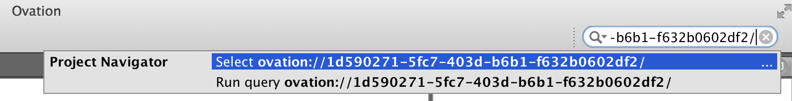

.. _doc-search-guide:

******
Search
******

Ovation's powerful and intuitive search engine helps you find items in the database by keyword, property or protocol parameter.

Searching for many entities
===========================

Search queries are specified using a simple text syntax. Enter a search query into the Quick Search bar of the Ovation application toolbar to :ref:`search <doc-getting-started-search>` the database.

Keywords
********

To search for entities with a keyword, use the ``tag:`` operator. For example, to search for all entities with the "awesome" tag::

    tag:awesome

You can use quotes to denote tags that contain spaces or other punctuation. For example, to search for all entities with the "for barry" tag::

    tag:"for barry"

Properties
**********

To search for entities with a given property (any value) or entities with a particular value for a property, use the ``prop:`` operator. To search for all entities with a property name and any value, provide only the property name. For example, to find all entities with the "rating" property, regardless of value::

    prop:rating

You can use quotes to denote property names that contain spaces or other punctuation. For example, to search for all entities with the "my rating" property, regardless of value::

    prop:"my rating"

To search for entities with a given property value, provide the property name and value. For example, to find all entities with a value of 5 for the property "my rating"::

    prop:"my rating"=5

.. note:: Ovation's search engine will interpret numbers as...numbers. If you've added property values that look like numbers but are actually strings, enclose the values in quotes (e.g. ``prop:"my rating"="5"). If you're not sure, you can always search for both: ``prop:"my rating"=5 || prop:"my rating"="5"

Protocol and device parameters
******************************

To search for entities with a given protocol or device parameter (any value) or entities with a particular value for a protocol or device parameter, use the ``param:`` operator. To search for all entities with a protocol or device parameter name and any value, provide only the parameter name. For example, to find all entities with the "intensity" parameter, regardless of value::

    param:intensity

You can use quotes to denote parameter names that contain spaces or other punctuation. For example, to search for all entities with the "bounce rate" property, regardless of value::

    param:"bounce rate"

To search for entities with a given parameter value, provide the parameter name and value. For example, to find all entities with a value of 3 for the parameter "bounce rate"::

    prop:"bounce rate"=3

.. note:: Ovation's search engine will interpret numbers as...numbers. If you've added parameter values that look like numbers but are actually strings, enclose the values in quotes (e.g. ``param:"bounce rate"="3"). If you're not sure, you can always search for both: ``param:"bounce rate"=5 || param:"bounce rate"="5"

Boolean operators
*****************
Ovation's query syntax supports full boolean logic so you can use ``&&`` (AND) ``||`` (OR) and ``!`` (NOT) as well as ``(`` and ``)`` to combine operators. For example, to search for all entities with the tag "awesome" and either the tag "public" *or* "share"::

    tag:awesome && (tag:public || tag:share)
 

Searching by entity ID
======================

Every entity in the Ovation database has a unique, cryptographically secure identifier. Entity identifiers make it easy to refer to any Ovation object in an email, text message or chat. You can copy an entity's identifier to the clipboard by selecting the entity in any Navigator in the Ovation application and selecting "Copy" from the "Edit" menu. Ovation identifiers look like this::

    ovation://1d590271-5fc7-403d-b6b1-f632b0602df2/
    
You can jump directly to an entity by typing or pasting its identifier into the Quick Search field in the Ovation toolbar.

    Paste an entity identifier into the Quick Search field to jump directly to that entity in the Navigator
    
.. tip:: Entity identifiers are a great way to refer to an entity when emailing or chatting with collaborators. Anyone with access to the entity can jump directly to it using its identifier. Of course, if a user doesn't have access to that entity, they won't be able to see it, even if they have its identifier.

