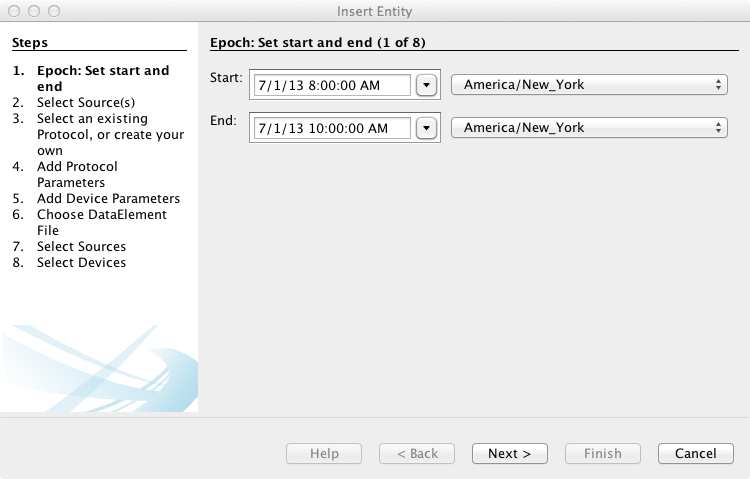
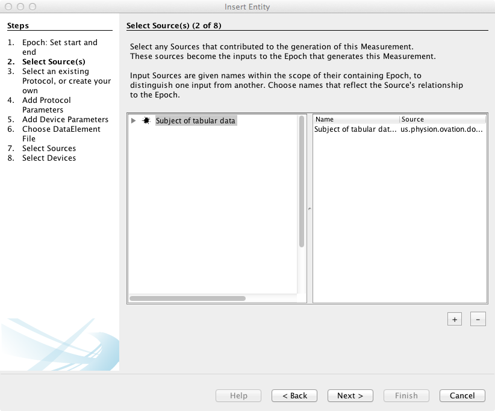
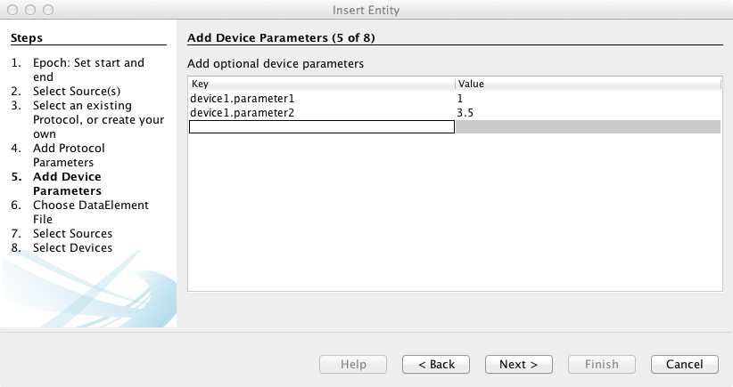
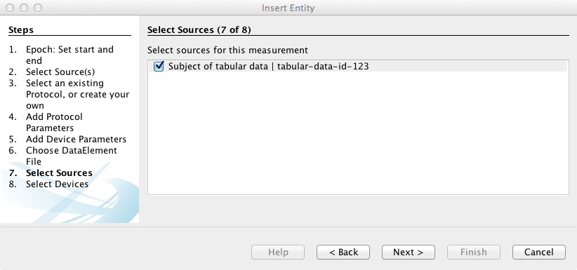
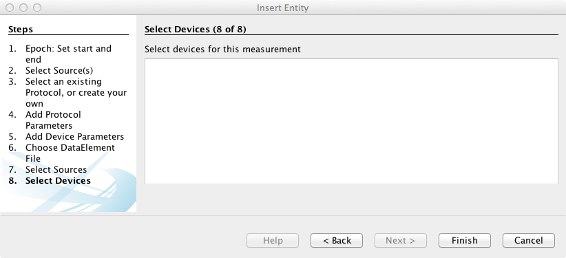

.. _ch-getting-started:

******************************************
Importing and analyzing tabular (CSV) data
******************************************

This chapter describes methods for importing and analyzign tabular `Measurement` data in Comma Separated Value (CSV) format with Ovation and the `Rovation.csv <https://github.com/physion/ovation-R-tabular-data>`_ package for R. Two methods for importing tabular data are described:

* :ref:`Importing tabular (CSV) data via the Ovation application <sec-importing-csv-data-app>`
* :ref:`Importing tabular (CSV) data from R using the Rovation.csv package <sec-importing-csv-data-rovation>`

This chapter also describes the `Rovation.csv` tools for collecting tabular `Measurements` as an R `DataFrame` object:

* :ref:`Retrieving tabular (CSV) data with Rovation.csv <sec-retrieving-csv-data-rovation>`

.. _sec-importing-csv-data:

Importing tabular (CSV) data
============================

.. _sec-importing-csv-data-app:

Importing CSV data via the Ovation application
**********************************************

This section describes the steps for importing a tabular (CSV) data file as a single `Measurement` (with its own `Epoch`) into an existing `Experiment` or `EpochGroup`. 

.. note::
    To add a CSV as a `Measurement` to an existing `Epoch`, right-click on the `Epoch` in the :guilabel:`Project Navigator` window, then select :menuselection:`Insert Measurement…`, select the CSV file from the file choooser dialog and set the content type to `text/csv`.
    

1. In the :guilabel:`Project Navigator` window, right-click on an `Experiment` or `EpochGroup` and choose :menuselection:`Insert Measurement…`

2. Enter the start and end times for the `Epoch` of time in which the tabular data was measured

   
   Enter the start and end times for the `Epoch` that describes the period of the experimental timeline in which the tabular data was measured. The :menuselection:`Insert Measurement…` wizard will add the tabular data as a `Measurement` to this newly inserted `Epoch`
   
3. Select the `Source(s)` that represent subjects of the measurements described in the tabular data

    
    Select each `Source` that represents a subject of the measurements in the tabular data in the left-hand panel, then click the :guilabel:`+` button to add the `Source` as an Input Source of the `Epoch`. The `Epoch's` Input Sources are shown in the right-hand panel. You can remove a `Source` from the right-hand panel by selecting the `Source` and clicking the :guilabel:`-` button.
    
4. Select the `Protocol` describing the procedure for collecting the tabular data. To add a new `Protocol`, enter the new `Protocol's` name and click the :guilabel:`+` button. Select the new `Protocol` in the left-hand panel and enter the procedure information in the `Protocol's` procedure document in the right-hand panel.

.. tip::
    If the `Protocol's` procedure has "variables" (i.e. values or substitutions such as a reagent's lot number or concentration), you can represent those variables as `{REAGENT_CONCENTRATION}` in the `Protocol's` procedure document. You will be able to supply values for each variable (e.g. the `REAGENT_CONCENTRATION` variable), the "Protocol Parameters" for the `Epoch` later in the wizard.

.. note::
    If there is no `Protocol`, you may select :guilabel:`<none>`. But you wouldn't make a `Measurement` without recording the procedure, right?
    
.. figure:: _static/ui_insert_measurement_panel3.png
    :width: 60%
    :align: center
    
    Select the `Protocol` describing the procedure for collecting the measurements in the tabular data.

5. Enter any "Protocol Parameters" for the `Epoch's` procedure. For each variable (e.g. `REAGENT_CONCENTRATION` in the example above), enter the variable's name as the :guilabel:`Key` and the variable's value for this `Epoch` as the :guilabel:`Value`.

.. figure:: _static/ui_insert_measurement_panel4.png
    :width: 60%
    :align: center
    
    For each variable (e.g. `REAGENT_CONCENTRATION` in the example above) in the `Epoch's` `Protocol`, enter the variable's name as the :guilabel:`Key` and the variable's value for this `Epoch` as the :guilabel:`Value`. You can double-click in the appropriate column to enter a value or use the :kbd:`tab` key to move between fields.
    
6. Enter any "Device Parameters" for the `Epoch`. For each variable parameter of the device(s) used to make the `Measurements` in the `Epoch`, enter the parameter's name as the :guilabel:`Key` and the parameter's value for this `Epoch` as the :guilabel:`Value`.

    
    For each variable parameter of the device(s) used to make the `Measurements` in the `Epoch`, enter the parameter's name as the :guilabel:`Key` and the parameter's value for this `Epoch` as the :guilabel:`Value`. You can double-click in the appropriate column to enter a value or use the :kbd:`tab` key to move between fields.
    
7. Select the `Sources`, from the `Epoch's` Input Sources, that are represented in the tabular data.

    
    Select the `Sources`, from the `Epoch's` Input Sources, that are represented in the tabular data. In this example, there is only one Input Source.
     
8. Select the Devices, from amongst the `Experiment's` `EquipmentSetup` description used to make the measurements described by the tabular data. 

    
    Select the Devices, from amongst the `Experiment's` `EquipmentSetup` description used to make the measurements described by the tabular data. In this example, there are no Devices in the `Experiment's` `EquipmentSetup` (and none used to make the measurements), so the selection is left blank.
     
9. Click :guilabel:`Finish` to insert the tabular measurement data.

.. figure:: _static/ui_tabular_data_display.png
    :width: 60%
    :align: center
    
    Tabular data is displayed in the Ovation application by selecting the `Epoch` (or individual `Measurement`) containing the data. The data table is displayed in the :guilabel:`Data Viewer` window.
    

.. _sec-importing-csv-data-rovation:

Importing CSV data using `Rovation.csv`
***************************************

`Rovation.csv <https://github.com/physion/ovation-R-tabular-data>`_ package provides an `ImportCSV` for importing tabular data in CSV format. The `ImportCSV` function expects tabular data with the `Source` label and identifier listed in columns within the dataset. `ImportCSV` provides a more "granular" import than adding an entire table as a single measurement from the Ovation application (see :ref:`above <sec-importing-csv-data-app>`). For each `Source` (identified by label and identifier), `ImportCSV` adds a single `Measurement` with just the data for that `Source` from the table.

In this example, we use the following `example.csv`:

============    =========   =========== =========== ===========
Source Label    Source ID   Col1        Col2        Col3
============    =========   =========== =========== ===========
label.1         id.1        0.378515032 0.4803887   0.278347607
label.2         id.2        0.752476952 0.464187255 0.769815514
label.3         id.3        0.715810992 0.510631993 0.404061552
label.3         id.3        0.464187255 0.378515032 0.464187255
============    =========   =========== =========== ===========

Given this table, `ImportCSV` will update the Ovation database, adding `Source` objects as needed and will then import a single `Epoch` with three `Measurements` containing the following individual tables:

**label.1-id.1**

============    =========   =========== =========== ===========
Source Label    Source ID   Col1        Col2        Col3
============    =========   =========== =========== ===========
label.1         id.1        0.378515032 0.4803887   0.278347607
============    =========   =========== =========== ===========

**label.2-id.2**

============    =========   =========== =========== ===========
Source Label    Source ID   Col1        Col2        Col3
============    =========   =========== =========== ===========
label.2         id.2        0.752476952 0.464187255 0.769815514
============    =========   =========== =========== ===========

**label.3-id.3**

============    =========   =========== =========== ===========
Source Label    Source ID   Col1        Col2        Col3
============    =========   =========== =========== ===========
label.3         id.3        0.715810992 0.510631993 0.404061552
label.3         id.3        0.464187255 0.378515032 0.464187255
============    =========   =========== =========== ===========

Example Usage
-------------

This example shows the `ImportCSV` function in action. The `EXPERIMENT.URI` and `PROTOCOL.URI` variables should be replaced with the Ovation URI of an `Experiment` or `EpochGroup` and a `Protocol` respectively and `EMAIL` with your `ovation.io <https://ovation.io>`_ registered email. You can find the URI of an object by calling the `getURI()` method on that object from Ovation's API or selecting the object in the Ovation application and choosing :menuselection:`Edit --> Copy` to copy the object's URI to the clipboard::

    library(Rovation)
    library(Rovation.csv)

    ctx <- NewDataContext("EMAIL")
    protocol.parameters = list(param.1=1, param.2="abc") # Replace with your Protocol's parameters here
    device.parameters = list(param.1=10, param.2="xyz") # Replace with your devices' parameters here
    devices <- c("device.1", "device.2") # Replace with a vector the names of any devices used to make the measurements

    start.time <- Datetime(2013,1,1) # Replace with the Epoch start time
    end.time <- Datetime(2013,1,2) # Replace with the Epoch end time

    epoch <- ImportCSV(ctx,
                       "example_fixture.csv", # Replace with the path to your .csv file
                       start.time,
                       end.time,
                       "PROTOCOL.URI",
                       protocol.parameters,
                       devices,
                       device.parameters,
                       "EXPERIMENT.URI")

Upon completion, `epoch` is a reference to the newly inserted `Epoch` object.

.. _sec-retrieving-csv-data-rovation:

Retrieving tabular (CSV) data
=============================

`Rovation.csv <https://github.com/physion/ovation-R-tabular-data>`_ package provides `CollectEpochs` and `CollectMeasurements` functions for building an R `DataFrame` object from the collected `Measurements` of an `Experiment` or `EpochGroup`. Only `Measurements` whose data is Comma Separated Value (i.e. type `text/csv` or `application/csv`) are collected.

.. _ssec-collecting-epochs:

Collecting all `Epochs` from an `Experiment` or `EpochGroup`
************************************************************

To collect all of the `Epochs` belonging to an `Experiment` or `EpochGroup`, use the `CollectEpochs` function. In the example below, replace `EMAIL` with your `ovation.io <https://ovation.io>`_ registered email, and `CONTAINER.URI` with the URI of the container (`Experiment` or `EpochGroup` from which you wish to collect Epochs)::

    library(Rovation.csv)
    ctx <- NewDataContext("EMAIL")
    container <- ctx$getObjectWithURI("CONTAINER.URI")

    epochs <- CollectEpochs(container)

Collecting `Measurements` from a list of `Epochs`
*************************************************

To collect a `DataFrame` containing the tabular data from a list of `Epochs`, use the `CollectMeasurements` function. You may build a list of `Epochs` manually or from the output of the `CollectEpochs` function (see :ref:`above <ssec-collecting-epochs>`). Continuing the example from :ref:`above <ssec-collecting-epochs>`, this example shows how to reconstruct a `DataFrame` from the list of `Epochs` returned by `CollectEpochs`::

    library(Rovation.csv)

    df <- CollectMeasurements(epochs)
